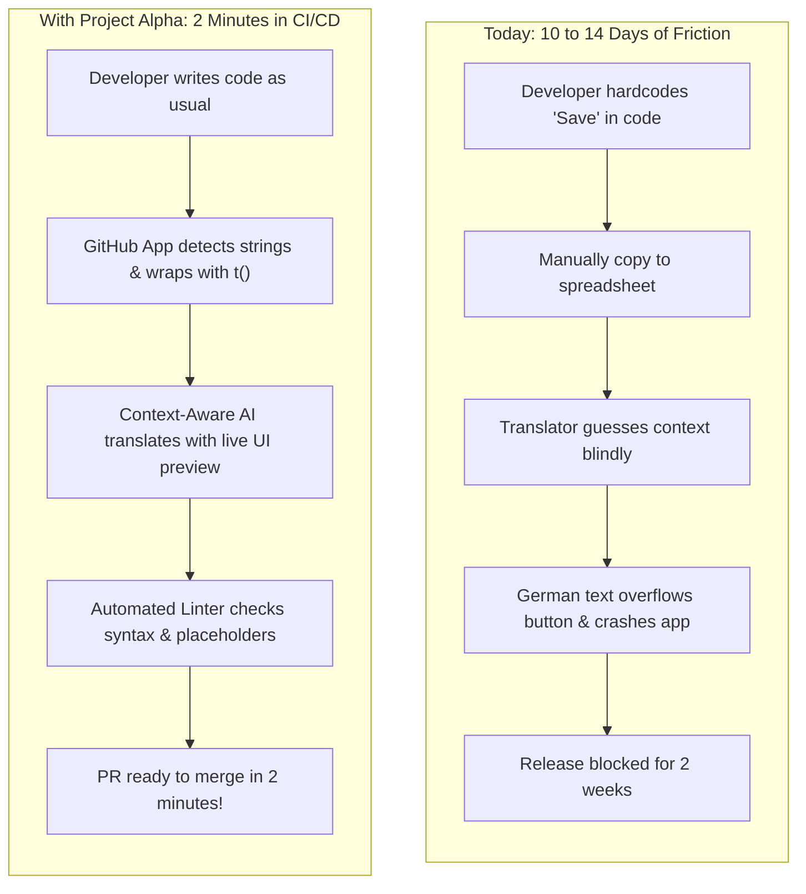

# Project Alpha / GILTflow: Executive Product Brief

> **The 5-Minute Plain-English Guide to What We Are Building, Why It Wins, and How It Works**

---

## 1. The Big Idea in One Sentence

> **We are building the "Stripe for Languages"—a developer-first tool that automatically finds hardcoded text in your code, translates it in seconds using context-aware AI, checks that nothing is broken, and opens a clean GitHub Pull Request.**

Like how Stripe turned complex banking integration into 5 lines of code, Project Alpha turns a 2-week localization nightmare into an automated 2-minute GitHub pull request.

---

## 2. The Real Problem: The "Before vs. After"

### The "Before" (How teams suffer today):

1. **Hardcoded Text Everywhere:** Developers build fast. They write `<button>Add to Cart</button>` directly in code. When it's time to launch in Germany or Japan, they realize they have 500+ text strings scattered across 60 files.
2. **Spreadsheet Ping-Pong:** Someone manually copies these strings into Excel or an expensive tool like Lokalise ($120/mo to $800/mo).
3. **Context Blindness:** Translators see a row with just the word _"Run"_. They don't know if it means _"jogging"_, _"run a report"_, or _"running late"_. They guess wrong, or spend 3 days asking on Slack.
4. **Broken Layouts & Crashes:** German text is 40% longer and breaks the buttons. An AI tool translates `{userName}` into `{nomDutilisateur}`, and the app crashes in production.
5. **Release Lag:** An engineering team that ships code twice a day has to wait **10 to 14 days** every time they release a feature in other languages.



### The "After" (How it works with Project Alpha):

1. Developer pushes code to GitHub.
2. Project Alpha's GitHub App automatically spots the text `<button>Add to Cart</button>`.
3. It wraps it cleanly as `<button>{t('add_to_cart')}</button>`, updates `en.json`, and translates it into German, French, and Japanese in seconds.
4. It checks that variables like `{userName}` weren't touched and that brackets match.
5. It opens an automated Pull Request with a visual preview. The developer reviews the diff and clicks **Merge**.

---

## 3. Why the "All-in-One GILT" Idea Was Challenged

The original proposal was an "All-in-One GILT Platform" that does everything: CMS, accounting, legal compliance, design, code editor, and translation agency.

**Why that is a trap in the real world:**

- **You can't be good at 18 things at once:** If you build a CMS, you compete with Contentful. If you build an accounting tool for invoices, you compete with QuickBooks and Plunet. If you build a code editor, developers will never leave VS Code.
- **The Winning Strategy (The Wedge):** Start with the **bleeding-neck pain**: **code-level internationalization and continuous Git automation**. Solve the developer-to-pull-request loop 10x better than anyone else. Then expand into design and marketing workflows once you own the engineering pipeline.

---

## 4. How the Product is Structured: "One Brain, Many Hands"

```
THE BRAIN: Central Cloud Platform (app.projectalpha.com)
  ├── Smart Parser: Understands React, Next.js, Vue, iOS, Android
  ├── Memory & Terms: Remembers past translations so you never pay twice
  ├── Context-Aware AI: Feeds glossaries & screen context to AI so it never guesses
  ├── Quality Gate: Automated linter that catches broken code before shipping
  └── Web Editor: Clean browser workspace for human linguists & reviewers

THE HANDS: Tools that reach into where your team actually works
  ├── Hand 1: GitHub App & CLI (Where developers live) - Fixes code & opens PRs
  ├── Hand 2: VS Code Extension (Where developers type) - Highlights hardcoded text
  ├── Hand 3: Figma Plugin (Where designers work) - Warns if German text overflows
  └── Hand 4: Web Workbench (Where linguists work) - Fast review & approval
```

---

## 5. Who Buys This and Why

- **Target Customer:** High-growth tech companies (50 to 1,000 employees) with 15–100 engineers shipping web and mobile apps.
- **The Buyer:** VP of Engineering or Head of Product, alongside the Localization Lead.
- **Why they switch:**
  1. **Zero Git Merge Conflicts:** No more fighting over broken JSON files.
  2. **10 Days to 10 Minutes:** Instant releases in 20+ languages.
  3. **No Pricing Extortion:** Unlimited strings and seats. We charge for real platform usage (sync pipelines and AI tokens), not arbitrary "hosted key caps".

---

## 6. What We Build in Phase 1 (MVP) vs. What We Deliberately Skip

### What We Build First (Core MVP):

1. **GitHub App & CLI:** Automatic scan on `git push`, finds strings, auto-wraps with `t()`, generates `en.json` and target languages (`de.json`, `es.json`, etc.).
2. **Bulletproof Code Parser:** Handles plain text, variables (`{user.name}`), and plurals without breaking code.
3. **Context-Aware AI Translation:** Translates using glossaries and component context so words like "Save" are translated correctly.
4. **Deterministic Linter:** Guarantees placeholders and brackets match 100% so code never crashes in production.
5. **Collaborative Web Workbench:** Clean web editor for translators with segment locking so team members don't overwrite each other.

### What We Deliberately Skip (Anti-Features):

- ❌ **No Desktop Windows Software:** (Desktop CAT apps are dinosaurs from the 1990s).
- ❌ **No Vendor Invoicing / Purchase Order Accounting:** (Leaves us free from tax/legal bureaucracy).
- ❌ **No Training Our Own AI Models from Scratch:** (Costs millions for no benefit; we orchestrate frontier models with context).
- ❌ **No Arbitrary Key Caps:** (We never hold customers' codebases hostage).

---

## 7. The 3-Phase Roadmap

| Phase                                | Timeline | Core Focus                                                                              | What Success Looks Like                                                          |
| :----------------------------------- | :------: | :-------------------------------------------------------------------------------------- | :------------------------------------------------------------------------------- |
| **Phase 1: The Core Loop (MVP)**     | Q4 2026  | Developer Ingestion $\rightarrow$ AI with Context $\rightarrow$ Linter $\rightarrow$ PR | 20 active repos, 5 paying customers ($1k+ MRR), 0 broken builds.                 |
| **Phase 2: Continuous Intelligence** | Q1 2027  | Git Branch Isolation, Visual DOM Previews, Figma Plugin, PR Bot                         | 100+ customers, unblocks 70%+ of translations with automated MQM quality scores. |
| **Phase 3: Enterprise Platform**     | Q2 2027  | Agency Marketplace, Over-the-air (OTA) updates, SAML SSO, SOC 2                         | $25k–$50k MRR, expansion into global enterprise accounts.                        |
