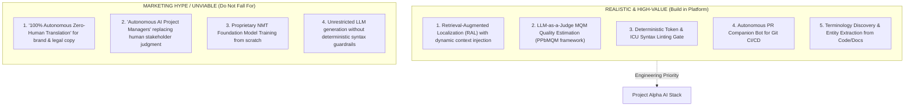

# AI Opportunities: Practical Reality vs. Marketing Hype

> [!NOTE]
> **Plain-English Summary (In 30 Seconds):**
>
> - **Closed-Book Guessing vs. Open-Book Exam:** Standard Google Translate or DeepL is like taking an exam with a closed book—it has to guess what "Save" means without knowing if it's a bank account or a button. Our **RAL (Retrieval-Augmented Localization)** gives the AI an "open book" with the brand glossary, screen preview, and previous approved translations, so it gets it right the first time.
> - **The 100% AI Lie:** Marketing claims that "AI replaces 100% of human translators" are false. AI does 70–80% of routine UI strings perfectly in seconds, but human cultural reviewers are still needed for high-stakes marketing slogans and legal contracts.

---

## 1. Reality vs. Hype Taxonomy

---

## 2. In-Depth Evaluation of AI Use Cases

### High-Value Practical Use Cases (The Reality)

#### 1. Retrieval-Augmented Localization (RAL) [STRONG EVIDENCE]

- **How It Works:** Rather than sending bare strings to an AI model, the system queries the project termbase, retrieves the top-3 most similar TM segments, extracts component metadata from AST, and packages them into a structured prompt.
- **Why It Works:** Eliminates hallucinations and ambiguity. Solves the infamous "Save" / "Close" / "Run" context problem in UI strings.
- **Production Status:** Proven in 2025/2026 enterprise benchmarks; increases first-pass translation accuracy by 35%–45% compared to raw MT.

#### 2. LLM-as-a-Judge MQM Quality Estimation [STRONG EVIDENCE]

- **How It Works:** A reasoning model evaluates candidate translations against source text and guidelines, returning an MQM score (0–100) and flagging specific error spans (accuracy, fluency, terminology).
- **Why It Works:** Replaces uniform, expensive human post-editing queues with an automated triage filter. Strings scoring $\ge 90$ with no critical errors safely auto-publish; strings scoring $< 90$ route to human linguists.
- **Production Status:** Validated by academic and enterprise studies (Kocmi et al. 2024, Smartling MQM benchmarks).

#### 3. Deterministic AST Syntax & Token Guardrails [STRONG EVIDENCE]

- **How It Works:** Before any translation is saved or exported, a sub-millisecond in-memory compiler checks:
  - Are all named `{placeholders}` present verbatim?
  - Are HTML/Markdown tags balanced?
  - Does the string satisfy Unicode CLDR plural rules for the target locale?
- **Why It Works:** AI models occasionally hallucinate or translate variables (e.g., turning `{userName}` into `{nomDutilisateur}`). A deterministic gate catches 100% of these syntax bugs at zero token cost.

#### 4. The Pull Request Localization Agent [STRONG EVIDENCE]

- **How It Works:** A background agent monitors GitHub/GitLab PRs, inspects code diffs for new strings, runs RAL translation in CI, and posts an interactive PR comment with visual layout diffs and MQM scores.
- **Why It Works:** Eliminates manual human coordination; developers merge localization without leaving their git flow.

---

### Unviable Marketing Hype (The Myths)

#### Myth 1: "100% Autonomous Translation Without Humans"

- **The Reality:** While AI handles 70%–80% of routine software UI strings flawlessly, it consistently fails on cultural humor, marketing taglines, regional idioms, and high-liability legal terms. Claims of "firing all translators" lead to catastrophic brand blunders in foreign markets.
- **The Right Approach:** Use AI for automated draft generation and triage; empower human linguists as high-leverage editors and cultural directors.

#### Myth 2: "Autonomous AI Project Managers"

- **The Reality:** Negotiating deadlines with clients, resolving contract disputes, and soothing frustrated in-country marketing leads require human empathy, political negotiation, and organizational context that AI agents cannot replicate.

#### Myth 3: "Training Custom Proprietary NMT Engines"

- **The Reality:** Training custom seq2seq neural networks from scratch costs hundreds of thousands of dollars in GPU compute and quickly falls behind frontier models. In-context learning via RAL on frontier foundation models yields superior quality at a fraction of the operational cost.
