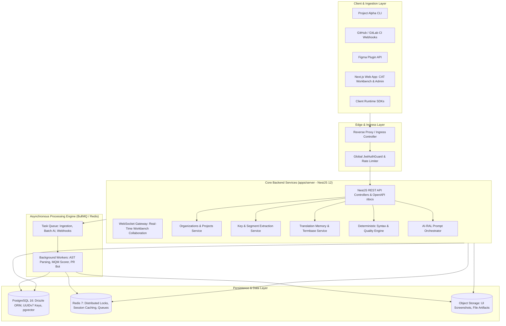
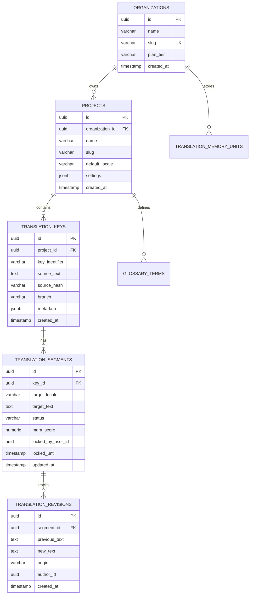

# Architecture: Technical System Blueprint & Data Modeling

> [!NOTE]
> **Plain-English Summary (In 30 Seconds):**
>
> - **The Core Engine:** We build on the solid, modern tech stack already in our repository: a fast Node.js/NestJS backend (`apps/server`) and PostgreSQL 16 database with Drizzle ORM (`packages/database`).
> - **How Data Moves:**
>   1. Code pushes from GitHub trigger an automated scan.
>   2. The background engine parses the text, checks memory to see if we translated it before, and calls AI with brand context.
>   3. The linter makes sure `{name}` tags match, and the GitHub App commits the verified files to the branch.
>   4. Translators can view and edit everything in a fast, collaborative web editor.

---

## 1. High-Level System Architecture



---

## 2. Monorepo Organization & Codebase Conventions

Aligned with existing repository conventions (`pnpm-workspace.yaml`, Turborepo):

- **Backend:** `apps/server` (NestJS 12, ESM `"type": "module"`, NodeNext, relative imports ending in `.js`, `@nestjs/config` with strict Zod validation, Swagger at `/docs`).
- **Database Package:** `packages/database` (PostgreSQL 16 on port 5433 via `docker-compose.yml`, Drizzle ORM, RFC 9562 monotonic `uuidv7()` primary keys).
- **Validation Package:** `packages/validation` (Shared Zod schemas for auth, keys, segments, MQM scores).
- **Tooling:** Root flat `eslint.config.js` (0 warnings enforced), Vitest for unit/integration tests.

---

## 3. Database Schema Design (PostgreSQL 16 + Drizzle ORM)



### Drizzle Schema Code (`packages/database/src/schema.ts`)

```typescript
import {
  pgTable,
  varchar,
  text,
  timestamp,
  numeric,
  jsonb,
  index,
  uniqueIndex,
} from "drizzle-orm/pg-core";
import { uuidv7 } from "./uuid.js";
import { users } from "./schema.js";

// Organizations (Tenants)
export const organizations = pgTable("organizations", {
  id: varchar("id", { length: 36 })
    .primaryKey()
    .$defaultFn(() => uuidv7()),
  name: varchar("name", { length: 255 }).notNull(),
  slug: varchar("slug", { length: 100 }).notNull().unique(),
  planTier: varchar("plan_tier", { length: 50 }).notNull().default("free"),
  createdAt: timestamp("created_at", { withTimezone: true }).defaultNow().notNull(),
  updatedAt: timestamp("updated_at", { withTimezone: true }).defaultNow().notNull(),
});

// Projects within an Organization
export const projects = pgTable(
  "projects",
  {
    id: varchar("id", { length: 36 })
      .primaryKey()
      .$defaultFn(() => uuidv7()),
    organizationId: varchar("organization_id", { length: 36 })
      .notNull()
      .references(() => organizations.id, { onDelete: "cascade" }),
    name: varchar("name", { length: 255 }).notNull(),
    slug: varchar("slug", { length: 100 }).notNull(),
    sourceLocale: varchar("source_locale", { length: 20 }).notNull().default("en"),
    settings: jsonb("settings")
      .$type<{
        autoAiTranslation?: boolean;
        mqmApprovalThreshold?: number;
        gitProvider?: "github" | "gitlab";
      }>()
      .default({ autoAiTranslation: true, mqmApprovalThreshold: 90 }),
    createdAt: timestamp("created_at", { withTimezone: true }).defaultNow().notNull(),
    updatedAt: timestamp("updated_at", { withTimezone: true }).defaultNow().notNull(),
  },
  (table) => [uniqueIndex("project_org_slug_idx").on(table.organizationId, table.slug)],
);

// Translation Keys (Source strings extracted from code)
export const translationKeys = pgTable(
  "translation_keys",
  {
    id: varchar("id", { length: 36 })
      .primaryKey()
      .$defaultFn(() => uuidv7()),
    projectId: varchar("project_id", { length: 36 })
      .notNull()
      .references(() => projects.id, { onDelete: "cascade" }),
    keyIdentifier: varchar("key_identifier", { length: 512 }).notNull(),
    sourceText: text("source_text").notNull(),
    sourceHash: varchar("source_hash", { length: 64 }).notNull(), // SHA-256 for O(1) TM lookup
    branch: varchar("branch", { length: 255 }).notNull().default("main"),
    metadata: jsonb("metadata").$type<{
      filePath?: string;
      lineNumber?: number;
      componentName?: string;
      developerComment?: string;
      maxLength?: number;
    }>(),
    createdAt: timestamp("created_at", { withTimezone: true }).defaultNow().notNull(),
    updatedAt: timestamp("updated_at", { withTimezone: true }).defaultNow().notNull(),
  },
  (table) => [
    uniqueIndex("key_project_branch_ident_idx").on(
      table.projectId,
      table.branch,
      table.keyIdentifier,
    ),
    index("key_source_hash_idx").on(table.sourceHash),
  ],
);

// Translation Segments (Target locale values)
export const translationSegments = pgTable(
  "translation_segments",
  {
    id: varchar("id", { length: 36 })
      .primaryKey()
      .$defaultFn(() => uuidv7()),
    keyId: varchar("key_id", { length: 36 })
      .notNull()
      .references(() => translationKeys.id, { onDelete: "cascade" }),
    targetLocale: varchar("target_locale", { length: 20 }).notNull(),
    targetText: text("target_text"),
    status: varchar("status", { length: 50 }).notNull().default("DRAFT"), // DRAFT, PRE_TRANSLATED, TRANSLATED, REVIEWED, VERIFIED, STALE
    mqmScore: numeric("mqm_score", { precision: 5, scale: 2 }),
    lockedByUserId: varchar("locked_by_user_id", { length: 36 }).references(() => users.id, {
      onDelete: "set null",
    }),
    lockedUntil: timestamp("locked_until", { withTimezone: true }),
    updatedAt: timestamp("updated_at", { withTimezone: true }).defaultNow().notNull(),
  },
  (table) => [
    uniqueIndex("segment_key_locale_idx").on(table.keyId, table.targetLocale),
    index("segment_status_idx").on(table.status),
  ],
);

// Immutable Revisions / Audit Log for Segments
export const translationRevisions = pgTable(
  "translation_revisions",
  {
    id: varchar("id", { length: 36 })
      .primaryKey()
      .$defaultFn(() => uuidv7()),
    segmentId: varchar("segment_id", { length: 36 })
      .notNull()
      .references(() => translationSegments.id, { onDelete: "cascade" }),
    previousText: text("previous_text"),
    newText: text("new_text").notNull(),
    origin: varchar("origin", { length: 50 }).notNull(), // 'AI_RAL', 'HUMAN_LINGUIST', 'TM_EXACT', 'GIT_SYNC'
    authorId: varchar("author_id", { length: 36 }).references(() => users.id, {
      onDelete: "set null",
    }),
    createdAt: timestamp("created_at", { withTimezone: true }).defaultNow().notNull(),
  },
  (table) => [index("revision_segment_created_idx").on(table.segmentId, table.createdAt)],
);
```

---

## 4. Production SLAs & Operational Performance

| Metric                         | Target SLA                       | Architectural Strategy                                                                 |
| :----------------------------- | :------------------------------- | :------------------------------------------------------------------------------------- |
| **API Response Time (p95)**    | $\le 120\text{ ms}$              | Lean NestJS ESM controllers, cached JWT validation, indexed Drizzle queries.           |
| **Exact TM Lookup Latency**    | $\le 15\text{ ms}$               | In-memory Redis exact hash cache + B-Tree index on `source_hash` in PostgreSQL.        |
| **Fuzzy Vector TM Search**     | $\le 100\text{ ms}$              | HNSW index on pgvector embeddings with pre-filtering by source language.               |
| **AI Translation Turnaround**  | $\le 2.5\text{ s}$ per key       | Streaming LLM invocation with concurrent batch chunking (10–20 keys per batch).        |
| **Deterministic Syntax Lint**  | $\le 2\text{ ms}$                | Pure in-memory AST linter execution (zero I/O).                                        |
| **Concurrent WebSocket Users** | $10,000+$ active editors         | Horizontal socket clustering using `@socket.io/redis-adapter`.                         |
| **Batch Ingestion Capacity**   | $50,000$ keys in $< 60\text{ s}$ | Chunked bulk inserts in PostgreSQL via Drizzle batching inside a database transaction. |
