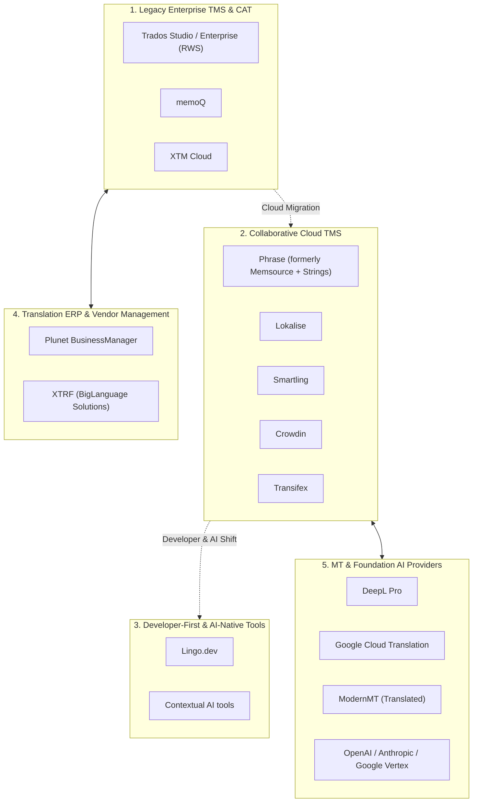

# Competitor Research: Landscape Overview & Category Taxonomy

This document categorizes the competitive landscape of the globalization and localization technology industry, segmenting platforms by architectural heritage, primary target customer, and operational focus.

---

## 1. Competitive Category Taxonomy

---

## 2. Segment-by-Segment Category Characteristics

### Category 1: Legacy Enterprise TMS & Desktop CAT (Trados, memoQ, XTM)

- **Origins:** 1990s – 2000s desktop Windows software.
- **Target Audience:** Traditional Language Service Providers (LSPs), agency project managers, and enterprise procurement departments.
- **Strengths:** Mature, deep translation memory algorithms, industry-standard file format support (XLIFF, TTX, SDLXLIFF), vast legacy linguist talent pool.
- **Weaknesses:** Clunky legacy user interfaces, near-zero native integration with modern Git CI/CD pipelines, expensive per-seat desktop licensing dongles, virtually impossible for modern web/mobile developers to adopt.

### Category 2: Collaborative Cloud TMS (Lokalise, Phrase, Smartling, Crowdin)

- **Origins:** 2010s SaaS explosion.
- **Target Audience:** Digital product companies, modern product managers, localization managers, and mobile app developers.
- **Strengths:** Web-based collaborative editors, REST APIs, basic GitHub/GitLab webhooks, Figma design plugins, mobile SDKs for over-the-air translation updates.
- **Weaknesses:** Predatory pricing levers (penalizing teams for hosting strings across multiple branches), context starvation in editor rows, fragile branch synchronization during continuous deployment, and bolted-on surface-level AI widgets.

### Category 3: Developer-First & AI-Native Tools (Lingo.dev, etc.)

- **Origins:** 2024–2026 AI and compiler revolution.
- **Target Audience:** Frontend software engineers, Next.js / React developers, AI-native startups.
- **Strengths:** Codebase compiler integration (zero manual `t()` key wrapping), native GitHub Actions CI/CD workflows, Retrieval-Augmented Localization (RAL).
- **Weaknesses:** Narrow tech stack support (heavily biased toward React/Next.js), lacking collaborative features for professional linguists, zero enterprise vendor management, and absent multi-stage human approval governance.

### Category 4: Translation ERP & Vendor Management Systems (Plunet, XTRF)

- **Origins:** Enterprise back-office management.
- **Target Audience:** Large LSPs and Fortune 500 corporate globalization departments.
- **Strengths:** Vendor invoicing, Purchase Order (PO) generation, margin accounting, complex multi-tier vendor bidding workflows.
- **Weaknesses:** Extremely complex legacy web interfaces, completely divorced from code repositories, high six-figure implementation costs.

### Category 5: Machine Translation & Foundation AI Engines (DeepL, ModernMT, OpenAI)

- **Origins:** Specialized AI research labs and frontier model providers.
- **Target Audience:** Software platforms integrating translation via APIs.
- **Strengths:** High raw translation speed, low per-word cost, strong linguistic fluency.
- **Weaknesses:** Pure API engines lacking workflow orchestration, translation memory leverage, UI context awareness, and project management capabilities.
