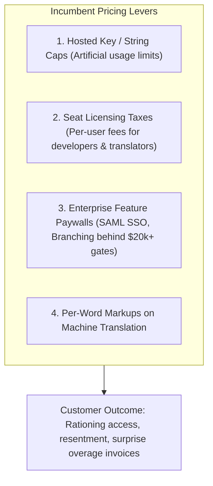

# Competitor Research: Pricing Models & Monetization Traps

> [!NOTE]
> **Plain-English Summary (In 30 Seconds):**
>
> - **The Incumbent Trap:** Legacy tools (like Lokalise and Phrase) charge based on "hosted keys" (the number of text strings in your account). When your developers create 5 Git branches to build new features, the string count quadruples, triggering sudden \$15,000–\$40,000 enterprise bills.
> - **The Per-Seat Tax:** They charge \$40–\$80 per user, which forces teams to lock developers and designers out of the tool.
> - **Our Unfair Advantage:** We give **unlimited keys and unlimited user seats**. We charge like modern cloud infrastructure (AWS/Vercel) based on active syncs and AI usage.

---

## 1. The Incumbent Monetization Playbook

Incumbent cloud TMS platforms (Lokalise, Phrase, Crowdin, Smartling) monetize through four primary levers:

### 1. The "Hosted Key" Trap [PAIN POINT]

- **How It Works:** Platforms define their tiers by the number of unique source keys stored in their database (e.g., 3,000 keys for \$140/mo, 10,000 keys for \$350/mo).
- **Why It Traps Customers:**
  - When a modern engineering team practices Git feature branching, each branch that introduces or edits strings creates a temporary duplication of keys.
  - Having 5 developers working on separate feature branches can instantly quadruple a company's "hosted key" count.
  - Teams receive automated warning emails that their account is frozen or subject to punitive per-thousand-key overage fees, forcing a frantic upgrade to custom enterprise contracts (\$15,000–\$40,000+/year).
- **Customer Reaction:** Leads to deep resentment, forcing engineering teams to write scripts to aggressively delete branch keys or restrict localization testing.

### 2. The Per-Seat License Tax [PAIN POINT]

- **How It Works:** Charging \$20–\$80 per user per month for platform access.
- **Why It Fails:** Localization is fundamentally cross-functional. A healthy localization workflow requires participation from software engineers, product designers, copywriters, regional marketing managers, and freelance translators.
- **Customer Reaction:** To save money, companies purchase only 1 or 2 seats for the Localization PM. The Loc PM becomes a manual human bottleneck, exporting spreadsheets and pasting copy on behalf of dozens of colleagues who are locked out of the tool.

### 3. The Enterprise Security Paywall [PAIN POINT]

- **How It Works:** Gatekeeping essential enterprise security features—Single Sign-On (SAML/Okta), Role-Based Access Control (RBAC), and SOC 2 audit logs—exclusively on top-tier custom enterprise plans.
- **Customer Reaction:** Mid-market tech companies with strict security mandates (e.g., SOC 2 compliance) are forced to pay enterprise minimums of \$25,000+ even if their actual string volume is modest.

---

## 2. Project Alpha's Disruptive Pricing Strategy

Project Alpha aligns pricing with **true infrastructure utility and AI compute consumption**, eliminating artificial friction levers:

| Feature / Metric          | Incumbent Cloud TMS (Lokalise / Phrase) | Project Alpha Modern Strategy                                                                                                          |
| :------------------------ | :-------------------------------------- | :------------------------------------------------------------------------------------------------------------------------------------- |
| **Hosted Keys**           | Hard caps with punitive overages        | **Unlimited Hosted Keys** (Keys are cheap database rows)                                                                               |
| **User Seats**            | \$30–\$80 / user / month                | **Unlimited Collaborative Seats** (Everyone can collaborate)                                                                           |
| **Branch Management**     | Gated behind Enterprise tiers           | **Included by Default** (Essential for modern Git workflows)                                                                           |
| **Security (SSO / RBAC)** | Enterprise gate (\$25,000+ min)         | **Available on Standard Tiers** (Security is a non-negotiable right)                                                                   |
| **Monetization Engine**   | Artificial caps and word markups        | **Value-Aligned Infrastructure:** Active CI/CD sync pipelines, high-speed TM vector search, and direct AI token pass-through / margin. |
