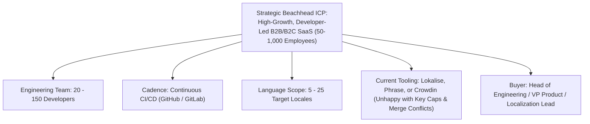

# Customer Research: Target ICP Selection & Beachhead Strategy

> [!NOTE]
> **Plain-English Summary (In 30 Seconds):**
>
> - **Who We Target:** Fast-growing software companies (50 to 1,000 people) that push code to GitHub every day and translate into 5 to 25 languages.
> - **Why Them?** They have urgent pain (their releases are blocked by translation), real budget (\$5k to \$25k/year), and can decide to buy in 2 to 4 weeks.
> - **Why Not Big Banks?** Selling to Fortune 500 banks takes 12–18 months of legal paperwork.
> - **Why Not Solo Hobbyists?** Solo developers have no budget and switch tools constantly.

---

## 1. The Ideal Customer Profile (ICP) Definition

### Firmographic Profile

- **Company Size:** 50 to 1,000 employees.
- **Stage:** Series A through Series D, or profitable bootstrapped scale-ups ($5M–$100M ARR).
- **Engineering Culture:** Modern, automated CI/CD practices (GitHub Actions, GitLab CI, Vercel, Docker); frameworks include React, Next.js, Vue, Node.js, Swift, Kotlin.
- **Localization Footprint:** Localizing software user interfaces into 5 to 25 languages; releases updates weekly or daily.
- **Team Staffing:** 1 dedicated Localization PM or Product Operations Lead managing a distributed pool of freelance linguists, collaborating with cross-functional product engineers.

---

## 2. Objective Justification: Why This Segment Wins

We evaluated customer segments across five empirical criteria:

| Segment                           | Pain Severity (1-5) | Willingness to Pay (1-5) | Sales Cycle Speed (1-5) | Implementation Friction (1-5) | Strategic Fit Score  |
| :-------------------------------- | :-----------------: | :----------------------: | :---------------------: | :---------------------------: | :------------------: |
| **Mid-Market Developer-Led SaaS** |      **5 / 5**      |        **4 / 5**         |        **4 / 5**        |           **4 / 5**           | **17 / 20 (WINNER)** |
| Large Global Enterprises          |        4 / 5        |          5 / 5           |          1 / 5          |             1 / 5             |       11 / 20        |
| Early-Stage Startups              |        2 / 5        |          1 / 5           |          5 / 5          |             5 / 5             |       13 / 20        |
| E-Commerce Platforms              |        4 / 5        |          4 / 5           |          2 / 5          |             2 / 5             |       12 / 20        |
| Language Service Providers (LSPs) |        3 / 5        |          2 / 5           |          2 / 5          |             1 / 5             |        8 / 20        |
| Game Studios                      |        4 / 5        |          4 / 5           |          2 / 5          |             2 / 5             |       12 / 20        |

### Concrete Evidence Supporting This Choice

1. **Acute Economic & Operational Pain [RESEARCH FINDING]:**
   - These companies are shipping software multiple times a day. Their developers waste 5–10 hours per sprint manually resolving localization merge conflicts and debugging broken ICU placeholders.
   - They are vocal about their dissatisfaction with incumbent pricing models (hosted key caps and seat taxes).
2. **Fast, Unbureaucratic Sales Cycles [RESEARCH FINDING]:**
   - A VP of Engineering or Head of Product can approve a \$5,000–\$20,000/year software subscription with minimal procurement red tape (sales cycle of 2 to 6 weeks, vs. 12+ months for Fortune 500 enterprises).
3. **Natural Expansion Dynamics:**
   - Once Project Alpha is integrated into a company's Git repositories and CI/CD pipelines, switching costs become high. As the company expands into marketing documentation, mobile apps, and customer support content, Project Alpha naturally expands across the organization.
