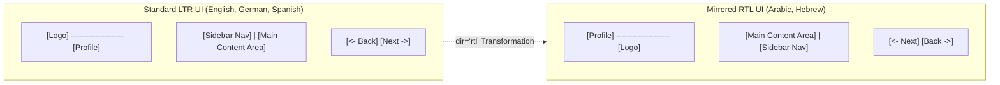

# Domain Knowledge: Bidirectionality (BiDi), RTL & Global Typography

> [!NOTE]
> **Plain-English Summary (In 30 Seconds):**
>
> - **RTL (Right-to-Left):** Languages like Arabic, Hebrew, Urdu, and Persian are read from right to left. When localizing into these languages, the entire visual interface must mirror: sidebars move to the right, buttons flip, but numbers and phone codes remain left-to-right!
> - **The Common Trap:** Naive CSS (like `float: left` or `margin-left: 10px`) breaks RTL interfaces. Modern internationalization requires CSS Logical Properties (`margin-inline-start`) and BiDi isolation (`<bdi>`).
> - **CJK Typography:** Chinese, Japanese, and Korean have strict line-breaking rules (Kinzoku Shori) and require minimum font sizes so complex strokes don't blur.

---

## 1. Bidirectional (BiDi) Layout & The Right-to-Left (RTL) Reality

Translating software into RTL languages (Arabic, Hebrew, Persian, Urdu) is not just a text translation task—it is a **complete visual UI mirror**:



### What Flips vs. What Stays LTR

| UI Element               | In LTR (English)        | In RTL (Arabic/Hebrew)        | Technical Implementation Rule                                                                   |
| :----------------------- | :---------------------- | :---------------------------- | :---------------------------------------------------------------------------------------------- |
| **Navigation & Drawers** | Left side of screen     | Right side of screen          | Use CSS `inset-inline-start` instead of `left: 0`.                                              |
| **Reading Order**        | Left to right           | Right to left                 | Set `dir="rtl"` on `<html>` or container.                                                       |
| **Back & Forward Icons** | `<-` Back, `->` Forward | `->` Back, `<-` Forward       | Directional icons must mirror; universal icons (search magnifying glass, camera) do NOT mirror. |
| **Phone Numbers**        | `+1 555-123-4567`       | `+1 555-123-4567` (STAYS LTR) | Phone numbers and code snippets stay LTR; wrap in `<bdi dir="ltr">`.                            |
| **Numbers & Timers**     | `12:45 PM`              | `12:45` (STAYS LTR)           | Digits and clock timestamps are read LTR even inside Arabic text.                               |
| **Progress Bars**        | Fills left to right     | Fills right to left           | HTML `<progress>` mirrors automatically when parent has `dir="rtl"`.                            |

---

## 2. CSS Logical Properties: The Engineering Standard

Legacy frontends built with hardcoded directional CSS break completely when localized into Arabic or Hebrew:

```css
/* ❌ BAD: Hardcoded direction (Breaks in RTL) */
.card-content {
  margin-left: 16px;
  padding-right: 24px;
  text-align: left;
  border-left: 2px solid #0066cc;
}

/* ✅ GOOD: CSS Logical Properties (Adapts automatically to LTR & RTL) */
.card-content {
  margin-inline-start: 16px; /* Left in LTR, Right in RTL */
  padding-inline-end: 24px; /* Right in LTR, Left in RTL */
  text-align: start; /* Left in LTR, Right in RTL */
  border-inline-start: 2px solid #0066cc;
}
```

### The BiDi Punctuation Bug (Why the `<bdi>` Tag Exists)

When mixed LTR and RTL text appears together (e.g., an Arabic sentence containing an English username or URL), the browser's Unicode Bidirectional Algorithm can misplace trailing punctuation:

- **The Bug:** `"User @alex joined the chat!"` in Arabic might render the exclamation mark `!` at the far right instead of the end of the sentence.
- **The Solution:** Always wrap dynamic interpolation tokens in the HTML5 `<bdi>` (Bidirectional Isolation) element:
  ```html
  <p>{t('user_joined', { name: <bdi>{user.name}</bdi> })}</p>
  ```

---

## 3. CJK Typography: Chinese, Japanese & Korean

Asian languages (CJK) do not use whitespace spaces to separate words, which introduces unique typographic constraints:

### 1. Japanese Line-Breaking (Kinzoku Shori - 禁則処理)

- Japanese grammar strictly forbids certain characters from appearing at the **start** or **end** of a line.
- **Forbidden at Start of Line:** Closing parentheses `)`, punctuation marks (`。`, `、`), quotation marks (`」`).
- **Forbidden at End of Line:** Opening parentheses `(`, opening quotes (`「`).
- **Engineering Rule:** Set `word-break: normal; line-break: strict;` in CSS. Never use `word-break: break-all;` on Japanese text, which creates broken, unreadable breaks.

### 2. Font Sizing & Stroke Density

- Kanji and Traditional Chinese characters have dense stroke counts (e.g., `鬱` has 29 strokes).
- **The Legibility Threshold:** Font sizes below 12px blur together on standard displays. UI buttons must maintain a minimum font size of **13px–14px** for CJK locales.
- **Line Height:** CJK characters occupy full square em-boxes. While English looks good with `line-height: 1.2`, CJK text requires `line-height: 1.5–1.7` to prevent lines from colliding.
