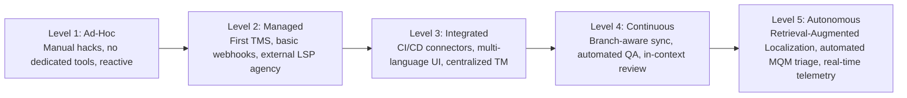

# Domain Overview: The Localization Maturity Model

This document maps the **Localization Maturity Model (LMM)** across modern technology companies, diagnosing the operational transitions, organizational friction, and architectural breakdown points at each stage of maturity.

---

## 1. The 5 Stages of Localization Maturity

| Level                               | Operational Reality                                                                                                           | Tech Stack & Tooling                                                                           | Key Bottlenecks                                                                             |
| :---------------------------------- | :---------------------------------------------------------------------------------------------------------------------------- | :--------------------------------------------------------------------------------------------- | :------------------------------------------------------------------------------------------ |
| **Level 1: Ad-Hoc / Reactive**      | No localization budget or strategy. Initiated only when a key customer or investor demands a local version.                   | Spreadsheets (Google Sheets), hardcoded code string hacks, raw DeepL/Google Translate.         | Copy-paste errors, broken production builds, complete lack of version control.              |
| **Level 2: Managed**                | First localization PM hired. Primary focus is outsourcing content batches to a single translation agency (LSP).               | Basic Cloud TMS (Crowdin, Transifex), manual file exports, quarterly waterfall drops.          | 2–4 week turnaround latency, disconnected from software engineering sprints.                |
| **Level 3: Integrated**             | Localization integrated into main development repository via webhooks and CLI tools. Multiple locales supported concurrently. | Modern Cloud TMS (Lokalise, Phrase), GitHub Actions, Figma plugins.                            | **The "Hosted Key" cost trap, context starvation, merge conflicts during branch rebasing.** |
| **Level 4: Continuous**             | High-velocity continuous deployment. Translations ship synchronously with feature releases.                                   | Deep Git branch integration, automated screenshot ingestion, MTPE triage queues.               | Review bottlenecks (in-country marketing delays), high MT post-editing costs.               |
| **Level 5: Autonomous & Optimized** | AI-native globalization infrastructure. Automated quality governance, real-time customer feedback loops.                      | Retrieval-Augmented Localization (RAL), LLM-as-a-Judge MQM scoring, zero-touch PR deployments. | Maintaining terminology governance across distributed microservices and LLM drift.          |

---

## 2. Where Modern Tech Companies Get Stuck

The vast majority of modern technology companies (particularly high-growth venture-backed SaaS and consumer tech) are trapped between **Level 3 (Integrated)** and **Level 4 (Continuous)**:

- **The Level 3 $\rightarrow$ Level 4 Chasm [OBSERVATION]:**
  - Engineering ships continuously (Level 4/5 velocity).
  - Localization operates on batch approvals (Level 2/3 velocity).
  - The cloud TMS tools purchased to bridge this gap (Lokalise, Phrase) solve basic webhook sync but fail at scale because:
    1. They charge exorbitant fees as string volume expands on multiple branches.
    2. They do not automatically evaluate quality, forcing expensive human post-editing for every trivial string.
    3. They lack code-level contextual awareness, causing linguists to repeatedly break developer sprints with clarification questions.

**Project Alpha's Strategic Positioning:** Enable Level 3 tech companies to instantly jump to **Level 4/5 Continuous & Autonomous Localization** without building custom enterprise middleware or hiring an army of localization coordinators.
