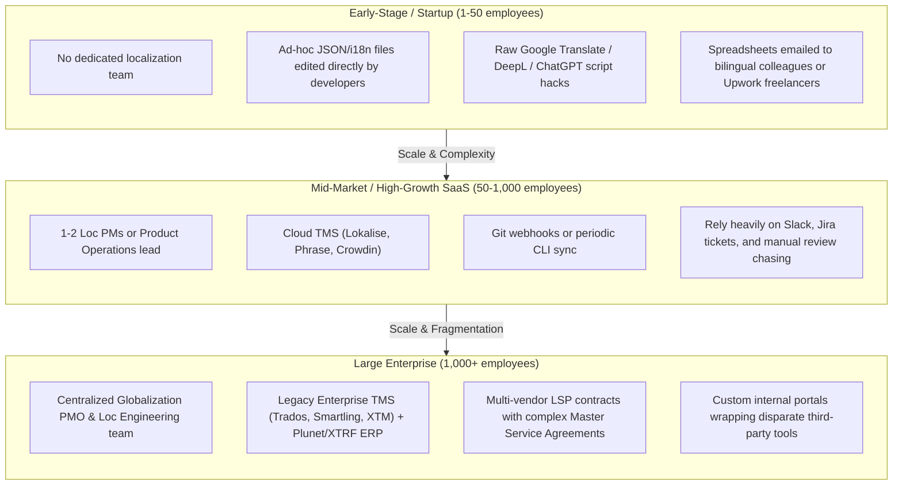

# Domain Overview: How the Industry Actually Operates Today

> [!NOTE]
> **Plain-English Summary (In 30 Seconds):**
>
> - **GILT** stands for **G**lobalization (business expansion), **I**nternationalization (code preparation), **L**ocalization (cultural adaptation), and **T**ranslation (word conversion).
> - In the real world, almost every company starts with messy spreadsheets and manual hacks. As they grow, they buy expensive tools like Lokalise or Phrase, but end up spending hours in Slack chasing missing screenshots and fixing broken Git merge conflicts.
> - **The Big Opportunity:** Eliminate the manual copy-pasting, screenshot chasing, and broken builds by connecting code directly to context-aware AI.

---

## 1. How Companies of Different Scales Actually Operate



### A. Early-Stage Startups (< 50 Employees)

- **Team Structure:** No dedicated localization staff. Product engineers or solo founders handle i18n as an afterthought.
- **Tooling:** Direct JSON/YAML files in Git (`react-i18next`, `@formatjs`, `flutter_i18n`).
- **The Reality [OBSERVATION]:**
  - Strings are translated using ad-hoc Python/Node scripts calling OpenAI or DeepL APIs directly in a terminal.
  - When quality fails, founders share Google Sheets with bilingual friends, overseas team members, or cheap Upwork contractors.
  - Translations are manually committed back into Git repository branches by developers.
  - Invalidation is nonexistent: when English copy changes, foreign language files remain silently out of date until an international user complains.

### B. Mid-Market / High-Growth Scale-Ups (50 – 1,000 Employees)

- **Team Structure:** 1–2 Localization Project Managers (often reporting to Product Operations, Content, or Marketing), working alongside 20–150 software engineers and a distributed network of external freelance translators or a single agency.
- **Tooling:** Modern Cloud TMS (Lokalise, Phrase, Crowdin) connected to GitHub/GitLab.
- **The Reality [PAIN POINT]:**
  - **The "Context Chasing" Loop:** Translators regularly stop work because string keys like `common.action.run` or `billing.cancel` lack context. Translators ping the Loc PM $\rightarrow$ Loc PM creates a Jira ticket or Slack message to the frontend engineer $\rightarrow$ Engineer spends 15 minutes finding the screen $\rightarrow$ takes a screenshot $\rightarrow$ uploads to TMS. Average latency per query: 24 to 72 hours.
  - **The Hosted-Key Extortion Shock:** Teams buy an entry-level tier ($150–$400/month). As product features expand and multiple branches are synced, they hit key limits and receive surprise invoices demanding enterprise contracts of $15,000–$40,000/year.
  - **The Branch Merge Nightmare:** Developers branching off `main` add new keys. When merged back, race conditions in the TMS cloud create duplicate keys or overwrite fresher translations, forcing developers to manually resolve JSON conflicts.

### C. Large Global Enterprises (1,000+ Employees)

- **Team Structure:** Dedicated Globalization Office (10–50+ people): Director of Globalization, Localization Engineers, Linguistic Quality Managers, Vendor Managers, plus dozens of outsourced Language Service Providers (LSPs) like TransPerfect, RWS, Lionbridge, and Welocalize.
- **Tooling:** Heavy enterprise TMS (Trados Enterprise, Smartling, XTM Cloud) integrated with Translation Management ERPs (Plunet BusinessManager, XTRF) and corporate single-sign-on (SAML/Okta).
- **The Reality [PAIN POINT]:**
  - **Extreme Tool Fragmentation:** Engineering uses GitHub and Phrase Strings; Marketing uses Contentful and Smartling; Legal uses Trados and email attachments. There is no unified view of global translation assets or spend.
  - **Custom Middleware Debt:** Enterprises employ dedicated localization engineers whose sole full-time job is writing and maintaining custom Python glue scripts, Jenkins jobs, and cron tasks to shovel files between Git, Contentful, Salesforce, and external LSP FTP servers.
  - **Massive Bureaucratic Latency:** Pushing a single copy change to production in 30 languages takes 2 to 4 weeks due to multi-tiered procurement approvals, purchase order (PO) generation, vendor bidding, and manual in-country marketing reviews.

---

## 2. What Is Automated vs. What Is Handled Manually

| Lifecycle Stage     | What Is Actually Automated Today                                                     | What Is Still Handled Manually (The Friction)                                                                                             |
| :------------------ | :----------------------------------------------------------------------------------- | :---------------------------------------------------------------------------------------------------------------------------------------- |
| **Ingestion**       | Webhooks trigger when files change on `main` branch.                                 | Developers must manually create keys, wrap strings in `t()`, configure namespace files, and resolve format syntax errors.                 |
| **Context**         | Basic key path and file name are sent to TMS.                                        | Screenshots must be manually captured and uploaded. Explanations of UI state, gender, and grammatical context require manual Slack pings. |
| **Pre-Translation** | Exact 100% TM matches are auto-populated. Basic MT (DeepL/Google) fills empty cells. | Identifying whether MT output is safe to publish vs. risky requires manual human spot-checking.                                           |
| **Assignment**      | Rule-based routing assigns jobs to designated vendor or linguist.                    | Chasing tardy translators, re-assigning abandoned jobs, and managing vendor capacity requires human PM babysitting.                       |
| **Quality Review**  | Basic regex linters check for missing `%s` placeholders.                             | Semantic accuracy, brand voice, cultural appropriateness, and layout overflow inspection remain 100% manual.                              |
| **Delivery**        | TMS pushes translated JSON back to Git via automated PR.                             | Engineers must manually review PR diffs, resolve merge conflicts with other feature branches, and test UI rendering locally.              |

---

## 3. The Shadow Workflow: What Happens Outside Dedicated Platforms

Vendor marketing pages depict an idyllic, seamless pipeline. In reality, modern localization operations rely heavily on an extensive "shadow workflow" conducted outside the TMS:

```mermaid
sequenceDiagram
    autonumber
    actor Dev as Developer
    actor PM as Loc PM
    actor Ling as Translator
    actor Rev as Regional Marketing Reviewer
    participant Slack as Slack / Teams Channel
    participant Sheets as Google Sheets
    participant Jira as Jira / Linear Tickets

    Dev->>Slack: "Hey, what key should I use for 'Renew Subscription'?"
    PM->>Sheets: Checks unapproved terminology tracker spreadsheet
    PM->>Slack: "Use billing.action.renew, but wait for French signoff."
    Ling->>PM: TMS Query: "Is 'Book' a flight reservation or a reading material?"
    PM->>Dev: Pings Dev on Slack asking for screenshot
    Dev->>PM: Sends screenshot via Slack 2 days later
    PM->>Ling: Pastes screenshot link into TMS comment
    Ling->>PM: Translation submitted
    PM->>Rev: Emails spreadsheet export to Regional Country Manager
    Rev-->>Slack: Ignores email for 6 days; PM follows up on Slack
    Rev->>Sheets: Marks approval in Google Sheet with manual edits
    PM->>Dev: Pings dev to manually re-trigger CI build
```

- **Slack / Microsoft Teams:** Acts as the real-time firefighting hub for missing context, broken builds, overdue review escalations, and ambiguous string meanings.
- **Google Sheets:** Used as the source of truth for terms being debated, vendor price rate comparisons, and tracking which regional marketing leads have approved upcoming releases.
- **Jira / Linear:** Used to track bugs caused by localization (truncated UI buttons, crashes from missing interpolation arguments, broken RTL layouts).

---

## 4. Where Human Intervention Is Indispensable vs. Where It Is Wasted

### Wasted Human Effort (High Opportunity for Automation)

1. **Manual File Packaging & Conversion:** Extracting, converting, zipping, and emailing XLIFF/PO/JSON bundles between CMSs, code repos, and LSPs.
2. **Context Gathering:** Taking manual screenshots, cropping them, and manually linking them to individual string IDs.
3. **Routine Deterministic Verification:** Manually checking whether `{name}` or `<b>` tags exist in target strings.
4. **Uniform Post-Editing of Simple Phrases:** Paying professional linguists to manually review routine, unambiguous strings like "Submit", "Settings", or "Next" that an AI engine translated with 99% accuracy.

### Indispensable Human Expertise (High-Value Human-in-the-Loop)

1. **Brand Voice, Slogan & Creative Transcreation:** Adapting marketing taglines, wordplay, humor, and cultural messaging where literal translation destroys emotional resonance.
2. **Regulatory & High-Stakes Compliance:** Financial contracts, medical device instructions, terms of service, and privacy policies where a mistranslation carries severe legal liability.
3. **Regional Cultural Strategy:** Advising product teams on color symbolism, taboos, local payment preferences, and date/calendar conventions in newly entered international markets.
