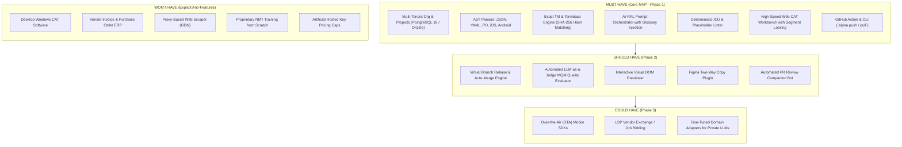

# Feature Research: Core MVP Scope vs. Anti-Features

This document establishes the boundaries of what **Project Alpha** will build in its Core MVP, supporting features, post-MVP enhancements, and explicit anti-features to avoid.

---

## 1. Feature Prioritization (MoSCoW Framework)

---

## 2. Granular Feature Specifications

### 1. Core MVP Features (Must Have)

1. **Multi-Tenant Workspaces & RBAC:**
   - Organizations, Projects, and granular permissions (`Admin`, `PM`, `Developer`, `Linguist`).
   - Built on existing `apps/server` (NestJS 12 ESM) and `@repo/database` (PostgreSQL 16, UUIDv7).
2. **AST Parsing Pipeline:**
   - Format-agnostic parsers for standard software files (JSON, nested JSON, YAML, PO, iOS strings, Android XML).
   - Tokenizes interpolation parameters and validates syntax before database persistence.
3. **Translation Memory & Glossary Storage:**
   - $O(1)$ exact source-hash lookup (SHA-256) + Levenshtein fuzzy match indexing.
   - Full TMX and TBX import/export support.
4. **Retrieval-Augmented Localization (RAL) Engine:**
   - Dynamic prompt assembly injecting glossaries, top-3 TM matches, character limits, and AST metadata into frontier LLMs.
5. **Deterministic Syntax Linter:**
   - Sub-millisecond in-memory validation checking bracket parity, parameter names, and CLDR plural completeness.
6. **Collaborative Web CAT Workbench:**
   - Clean, keyboard-accessible editor with segment locking (Redis-backed), concordance search, and diff views.
7. **Developer CLI & GitHub Action:**
   - `alpha push` / `alpha pull` commands and a GitHub Action enabling automated CI/CD synchronization.

---

### 3. Explicit Anti-Features (What We Will Deliberately Avoid)

| Anti-Feature                            | Why Incumbents Built It                                                             | Why Project Alpha Explicitly Rejects It                                                                                                |
| :-------------------------------------- | :---------------------------------------------------------------------------------- | :------------------------------------------------------------------------------------------------------------------------------------- |
| **Traditional Desktop CAT Application** | Built in the 1990s when cloud computing didn't exist.                               | High maintenance overhead; completely incompatible with real-time continuous deployment.                                               |
| **Vendor ERP & Invoicing Engine**       | Legacy agencies used TMS as their back-office accounting software.                  | High legal, tax, and accounting liability. Diverts engineering resources away from developer automation.                               |
| **Proxy-Based Web Scraping (GDN)**      | Allowed marketing teams to translate websites without engineering help in 2012.     | Fragile against modern client-hydrated single-page applications (React, Next.js). Code-level extraction is 10x more reliable.          |
| **Arbitrary Hosted Key Pricing Caps**   | Created by SaaS founders to maximize expansion revenue through artificial scarcity. | Alienates developers, causes customer resentment, and forces teams to write unnatural code workarounds.                                |
| **Proprietary NMT Model Training**      | Necessary before 2023 when general models were weak at translation.                 | Multi-million dollar compute expense with rapid obsolescence. RAL with frontier LLMs outperforms static NMT at a fraction of the cost. |
