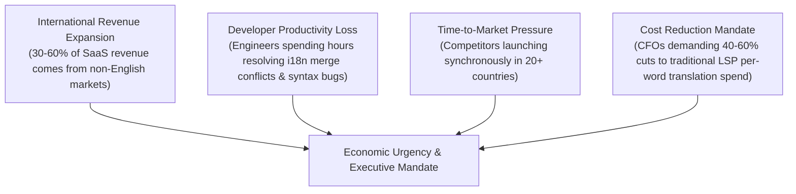

# Market Research: Customer Demand & Competitive Dynamics

This document examines customer demand drivers, enterprise adoption behaviors, startup market opportunities, competitive intensity, and why existing solutions leave critical market gaps unaddressed.

---

## 1. Customer Demand Drivers & Economic Urgency

Why are companies spending money on localization technology right now?

### The Enterprise Adoption Barrier [RESEARCH FINDING]

While enterprise demand is massive, large enterprises suffer from severe structural inertia:

- **Entrenched Master Service Agreements (MSAs):** Global enterprises (e.g., Siemens, Cisco, Ford) have multi-year vendor lock-in with giant LSPs (TransPerfect, RWS, Lionbridge). These LSPs provide their own bundled legacy TMS (often Trados or proprietary portals) and actively resist clients moving to modern automated software platforms that eliminate manual billable hours.
- **Complex Procurement Cycles:** Selling a new platform to an enterprise globalization department takes 9 to 18 months and requires hundreds of security certifications (SOC 2 Type II, ISO 27001, HIPAA, FedRAMP).

### The High-Growth Scale-Up Opportunity [HYPOTHESIS & EVIDENCE]

In contrast, **mid-market tech companies (Series A through Series D, 50–1,000 employees)** have high urgency, modern engineering stacks, and fast procurement cycles (2–6 weeks):

- They ship software via GitHub/GitLab multiple times a day.
- They are actively expanding into Europe, Latin America, and Asia-Pacific to drive revenue growth.
- They are deeply dissatisfied with incumbent tools (Lokalise, Phrase) due to predatory key pricing and clunky branch handling.
- **Conclusion:** This segment represents the ideal beachhead market for a modern platform.

---

## 2. Competitive Intensity vs. Market Gaps

```mermaid
flowchart LR
    subgraph Saturated ["Crowded / Saturated Spaces (Red Ocean)"]
        direction TB
        C1["Generic CAT Editors (Text table with segments)"]
        C2["Raw MT API Wrappers (Piping strings to Google Translate / DeepL)"]
        C3["Basic File Upload / Download Portals"]
    end

    subgraph Underserved ["High-Value Underserved Gaps (Blue Ocean)"]
        direction TB
        G1["Continuous Git Branch-Aware Localization (Zero merge conflicts)"]
        G2["Contextual Retrieval-Augmented Localization (AST + Visual grounding)"]
        G3["Automated 3-Tier Quality Governance (Deterministic + LLM MQM)"]
        G4["Transparent Infrastructure Pricing (No hosted key or seat taxes)"]
    end

    Saturated -.->|"Strategic Focus for Project Alpha"| Underserved
```

### Critical Market Gaps Unaddressed by Incumbents

1. **The Branch Synchronization Gap [PAIN POINT]:** No major incumbent handles Git branches cleanly. Incumbents treat branches as isolated projects or flat key overlays, causing massive synchronization race conditions when code branches merge back into `main`.
2. **The Context Starvation Gap [PAIN POINT]:** Incumbents force translators to work blind. Even platforms offering "in-context preview" require tedious manual screenshot uploads or fragile proxy scrapers that break on modern client-hydrated single-page applications (Next.js, React).
3. **The Quality Evaluation Gap [RESEARCH FINDING]:** Incumbents either rely on outdated statistical metrics (BLEU) or dump all machine translations into manual human post-editing queues. There is no automated triage system using the industry-standard Multidimensional Quality Metrics (MQM) framework to separate safe translations from risky ones.
