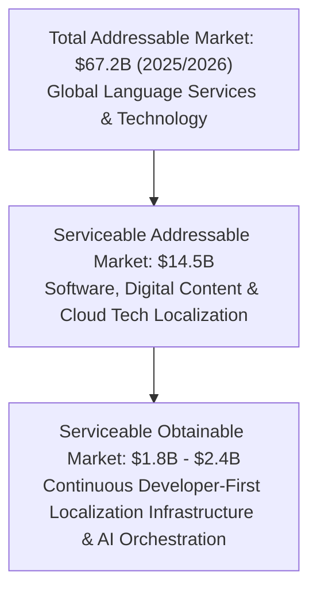
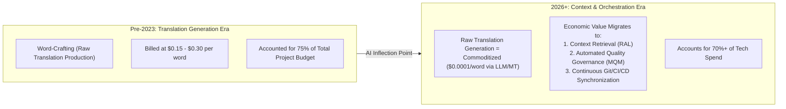

# Market Research: Market Size, Trends & The AI Value Shift

> [!NOTE]
> **Plain-English Summary (In 30 Seconds):**
>
> - **The Market is Huge:** Companies spend \$67+ Billion every year on global translation, and the software portion is booming (\$15B+ by 2032).
> - **The Big Shift:** AI made translating words almost free (fractions of a cent). But translating without context breaks software UI.
> - **Where the Money Is Moving:** Companies used to spend 75% of their budget paying people to translate words. Today, they are shifting their budgets to **automation software** that extracts strings from code, provides context to AI, and checks that nothing broke.

---

## 1. Market Size & Growth Projections

- **Global Language Services & Technology Market [FACT]:** Valued at **\$67.2 Billion** in 2025 (Slator / Nimdzi Market Reports), growing at a compound annual growth rate (CAGR) of 6.2%.
- **Language Technology Segment (TMS, MT, AI Quality Tools) [FACT]:** Represents **\$4.8 Billion** of the overall market, expanding at a much faster rate (**CAGR 14.8%**) as enterprise spend transitions from manual human hourly billing to software infrastructure subscriptions and AI token consumption.
- **The Software & SaaS Sub-Segment [FACT]:** Software and digital product localization constitutes the fastest-growing vertical in globalization, driven by the global distribution capabilities of cloud platforms (AWS, Vercel, Apple App Store, Google Play).

---

## 2. The Fundamental Reallocation of Economic Value

Generative AI and Large Language Models (LLMs) have initiated a structural disruption in the translation economy:

### The "Death of the Word Count" Paradox

- **Historical Model:** The language industry has operated on a **per-word unit of billing** since the 1970s. Translation agencies (LSPs) and legacy TMS platforms built their entire business models around charging clients per word translated, discounted slightly by fuzzy translation memory grids.
- **The Structural Collapse [OBSERVATION]:** Because frontier LLMs and advanced NMT engines now generate grammatically fluent translations for fractions of a cent per thousand words, the traditional markup on raw translation generation has collapsed.
- **Where the Value Lies Today [RESEARCH FINDING]:**
  - Companies no longer struggle to _generate_ translations.
  - Companies struggle with **Context, Coordination, and Quality Verification**:
    1. _Context:_ Did the AI know this was a button label, a menu title, or a database query?
    2. _Coordination:_ How do these translated strings get from GitHub pull requests to translators, reviewers, and back into production without manual copy-pasting or broken builds?
    3. _Quality Verification:_ How do we mathematically verify that the AI didn't hallucinate, omit a parameter, violate brand tone, or produce culturally offensive text?

---

## 3. Macro Market Trends & Customer Demand Drivers

### Trend 1: "Shift-Left" Internationalization

Historically, internationalization occurred at the end of the software development lifecycle (waterfall release). Modern engineering organizations are shifting i18n into pull requests and design systems, requiring automated linters and pseudo-localization in Figma and CI before code is ever merged.

### Trend 2: The Collapse of Release Cycles

Enterprise software deployments have accelerated from quarterly major releases to daily or continuous deploys. A localization process that takes two weeks is fundamentally incompatible with an engineering cadence that ships five times a day.

### Trend 3: Demand for Cultural Hyper-Localization

Entering an international market now requires more than superficial language translation. Modern global consumers demand local currencies, regional date/number formatting, culturally tailored imagery, and localized payment gateways. Systems that treat localization as mere text substitution are failing.

### Trend 4: Vendor Consolidation & Tooling Fatigue

Mid-market companies are actively seeking to eliminate fragmented point solutions (paying separately for a developer string tool, a marketing document translator, a Figma plugin, and an external translation agency portal). They want a coherent, unified workflow that handles their core digital product footprint.
