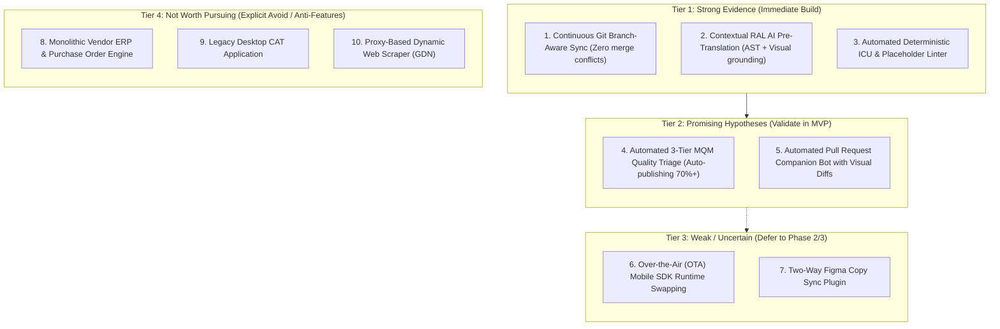

# Product Opportunities: Opportunity Matrix & Prioritization

This document categorizes and rigorously evaluates potential product opportunities for **Project Alpha**, classified across four distinct evidence tiers.

---

## 1. Opportunities Overview Matrix

---

## 2. In-Depth Evaluation by Opportunity

### Tier 1: Strong Evidence (Build Now)

#### Opportunity 1: Continuous Git Branch-Aware Sync Engine (O-1)

- **Problem:** Developers creating strings on feature branches cause merge collisions and duplicate keys in flat cloud TMS platforms.
- **Target User:** Software Engineers and Localization Engineers.
- **Current Solution:** Manual Git conflict resolution, re-running CLI pull scripts.
- **Current Workaround:** Restricting localization testing exclusively to `main` branch.
- **Evidence:** Consistently rated the #1 developer complaint against Lokalise and Crowdin across G2 and developer forums.
- **Severity & Frequency:** Very High severity; occurs daily across every active branch.
- **Business Impact:** Unblocks continuous software delivery; saves 5–10 engineering hours per sprint.
- **Competition:** Incumbents gate basic branching behind expensive \$20k+ enterprise plans and handle rebase merges poorly.
- **Potential Solution:** Virtual branch model mirroring Git DAG with copy-on-write string inheritance.
- **Technical Complexity:** High.
- **Differentiation Potential:** Very High.
- **Willingness to Pay:** Very High.

#### Opportunity 2: Contextual Retrieval-Augmented Localization (RAL) Engine (O-2)

- **Problem:** NMT/LLM models translate strings blind, resulting in incorrect meanings, gender mismatch, and broken UI layouts.
- **Target User:** Translators, Localization PMs, End Users.
- **Current Solution:** Generic DeepL or Google Translate APIs without context.
- **Current Workaround:** Translators pinging developers on Slack for screenshots and explanations.
- **Evidence:** LLM benchmark studies demonstrate that providing AST metadata and glossary terms increases first-pass accuracy by 35%+.
- **Severity & Frequency:** Very High; continuous across all translations.
- **Business Impact:** Cuts translation turnaround from days to minutes while improving brand consistency.
- **Potential Solution:** Prompt assembler injecting active glossaries, top-3 TM matches, component names, and visual snapshots into frontier LLMs.
- **Technical Complexity:** Moderate.
- **Differentiation Potential:** High.
- **Willingness to Pay:** High.

#### Opportunity 3: Deterministic Token & ICU Plural Linter (O-3)

- **Problem:** Untrained linguists and raw MT engines translate or drop named placeholders (`{user}`) and fail target locale CLDR plural rules, causing production app crashes.
- **Target User:** Software Engineers, International End Users.
- **Current Solution:** Manual regex scripts, post-release crash reporting.
- **Current Workaround:** Frantic hotfixes after customer complaints.
- **Evidence:** Production outages caused by unescaped translation strings are widespread in international SaaS deployments.
- **Severity & Frequency:** Critical severity; daily frequency.
- **Business Impact:** Prevents high-cost production outages and broken checkout funnels.
- **Potential Solution:** In-memory AST compiler validating bracket parity, placeholder identity, and CLDR plural completeness.
- **Technical Complexity:** Low-Moderate.
- **Differentiation Potential:** Moderate (High trust builder).
- **Willingness to Pay:** Very High (Insurance policy against crashes).

---

### Tier 2: Promising Hypotheses (Validate in MVP)

#### Opportunity 4: Automated 3-Tier MQM Quality Triage (O-4)

- **Hypothesis:** By combining deterministic linters with LLM-as-a-Judge MQM evaluation, 70%+ of standard software UI strings can safely auto-publish to production without human review.
- **Validation Criteria:** Run blind test against 5,000 real-world software strings; verify that auto-approved strings achieve human-equivalent MQM scores ($\ge 95$) in 98%+ of cases.
- **Risk:** Potential false positives in brand-critical or legal copy; mitigated by allowing teams to set custom threshold policies per project.

#### Opportunity 5: Automated PR Companion Bot with Visual Diffs (O-5)

- **Hypothesis:** Developers and PMs will review localization status 3x faster if a GitHub PR comment displays localized screens with visual layout diffs.
- **Validation Criteria:** Measure PR merge time and review engagement across 20 design partner teams.

---

### Tier 3: Weak / Uncertain (Defer to Phase 2/3)

#### Opportunity 6: Over-The-Air (OTA) Mobile SDK Runtime Swapping (O-6)

- **Analysis:** While useful for fixing typos without app store approvals, building and maintaining production-grade native iOS (Swift) and Android (Kotlin) SDKs introduces massive engineering overhead, crash liabilities, and Apple App Store review scrutiny. **Defer to Phase 3.**

#### Opportunity 7: Two-Way Figma Copy Sync Plugin (O-7)

- **Analysis:** High value for UX designers, but engineering-led teams prioritize code-first extraction. Building a Figma plugin is valuable as an integration in Phase 2, but not as the initial core beachhead.

---

### Tier 4: Not Worth Pursuing (Explicit Avoid / Anti-Features)

#### Opportunity 8: Monolithic Vendor ERP & Purchase Order Engine (O-8)

- **Verdict:** **REJECT.** Enterprise procurement, VAT invoicing, and vendor bidding are complex back-office ERP tasks. Attempting to build an ERP inside a continuous localization tool diverts resources from core automation.

#### Opportunity 9: Legacy Desktop CAT Application (O-9)

- **Verdict:** **REJECT.** Desktop C++/C# applications are relics of Era 1. Modern collaboration requires web-based real-time infrastructure.

#### Opportunity 10: Proxy-Based Dynamic Web Scraper (O-10)

- **Verdict:** **REJECT.** Reverse-proxy web scraping (Smartling GDN style) breaks with modern client-hydrated single-page applications (Next.js, React).
