# Product Discovery: Deep Synthesis & Critique of GILTflow Research & PRD

This document provides a rigorous, senior-level critique and synthesis of the research and PRD provided in `Giltflow-Validation-Report.md` and `GILTflow-Full-PRD.md`. We analyze what the other AI agent got right, expose critical real-world engineering flaws and naive assumptions in the proposal, and define the definitive path forward for **Project Alpha**.

---

## 1. Executive Synthesis: What Was Validated vs. What Was Overlooked

```mermaid
flowchart TD
    subgraph ValidatedInsights ["Strongly Validated Insights (ADOPT & ACCELERATE)"]
        direction TB
        V1["1. The 'I' (Internationalization) is the true bleeding-neck wedge (80% unsolved)"]
        V2["2. The AI Coding Agent Paradox: Cursor/Claude write hardcoded English strings by default"]
        V3["3. The Spotify 3-Layer Pattern: Prompt + MCP Server + Auto-Fix Linter PRs"]
        V4["4. Raw Translation (T) is a commoditized API layer (DeepL/OpenAI); do not build an MT engine"]
        V5["5. 15% of developer sprint time is wasted on translation file management"]
    end

    subgraph CriticalGaps ["Fatal Flaws & Naive Assumptions in PRD (CHALLENGE & FIX)"]
        direction TB
        G1["1. The 'Naive AST Wrapping' Trap: Breaks on ICU plurals, interpolation, and rich-text JSX"]
        G2["2. The 'English-Only en.json' Fallacy: Generates no localized value without immediate target files"]
        G3["3. The Cultural Flagging Gimmick: 'Cow in India / Thumbs-up' is irrelevant to code PRs"]
        G4["4. Complete Omission of Translation Memory (TM) & Content Hash Invalidation"]
        G5["5. The Developer-Only Ceiling: No collaborative web workbench for linguists and PMs"]
    end

    ValidatedInsights --> Solution["Project Alpha Upgraded Architecture"]
    CriticalGaps --> Solution
```



---

## 2. What the GILTflow Validation Report & PRD Got Right

1. **The True Wedge is "I" (Internationalization Auto-Fix):**
   - Traditional TMS platforms (Lokalise, Crowdin, Phrase) only manage translation files _after_ strings have been cleanly externalized into resource keys.
   - But in the wild, 70%+ of frontend codebases have hundreds of hardcoded strings (`<button>Add to Cart</button>`) that slip past code reviews.
   - Focusing on the **I-Scanner** as the initial wedge—an automated AST engine that detects hardcoded strings, wraps them with i18n hooks, and opens pull requests—solves a validated, burning engineering problem with virtually zero direct incumbent competition.
2. **The AI-Amplified Technical Debt (The 2026 Shift):**
   - The validation report identified a profound 2026 insight: **AI coding assistants (Cursor, Claude Code, GitHub Copilot) write hardcoded English by default**. As developers generate code 5x faster using LLMs, their un-internationalized technical debt accumulates at 5x the historical rate.
3. **The Spotify Architecture Proof Point:**
   - Spotify's internal localization team (Hilary Atkisson Normanha) validated a 3-layer architecture:
     - Layer 1: Prompt guidance in the coding agent.
     - Layer 2: Model Context Protocol (MCP) server providing Unicode CLDR and locale-fallback context.
     - Layer 3: A linter that catches un-internationalized code and opens automated fix PRs.
   - This confirms that our platform's technical architecture mirrors the internal tooling of world-class engineering organizations.
4. **Translation (T) is Commoditized:**
   - Translation execution accounts for only 3 out of 43 canonical localization tasks (LocWorld55 research). 84% of the durable enterprise value lies in orchestration, AST engineering, quality measurement, and workflow governance.

---

## 3. Critical Critique: 5 Fatal Flaws in the GILTflow PRD

While the strategic direction is sound, the GILTflow PRD suffers from several naive assumptions that would cause real-world production failure:

### Flaw 1: The "Naive AST Wrapping" Trap (Real Code Is Not Just Plain Text)

The GILTflow PRD provides simplistic pseudocode:

```typescript
// GILTflow Naive Pseudocode:
file.getDescendantsOfKind(SyntaxKind.JsxText).forEach((node) => {
  node.replaceWithText(`{t("${key}")}`);
});
```

**Why This Fails in Production [CRITICAL DEFECT]:**

- **Interpolation & String Concatenation:** If code contains `<p>Welcome back, {user.name}!</p>`, a naive text replacement turns it into `{t('welcome_back')}, {user.name}!`. This creates programmatic string concatenation, which destroys translation for Subject-Object-Verb (SOV) languages like Japanese, Korean, or Turkish!
  - _Required Engineering:_ The AST engine must parse the entire JSX expression container, extract variables, and compile a parameterized call: `{t('welcome_back', { name: user.name })}` with an ICU source string: `Welcome back, {name}!`.
- **Pluralization:** `<p>You have {count} items</p>` cannot be wrapped with a single key. It requires Unicode CLDR plural forms (`one`, `other` in English; `zero`, `one`, `two`, `few`, `many`, `other` in Arabic).
- **Rich Text & Nested JSX:** Code like `<span>Click <Link href="/terms">here</Link> to agree</span>` will be split into two broken fragments (`Click ` and ` to agree`). Real-world i18n requires wrapping with `<Trans>` components or tag tokens (`Click <0>here</0> to agree`).
- **React Hook Scope & Imports:** You cannot just drop `t('key')` into a file. The scanner must:
  1. Detect if the file is a Client Component (`'use client'`) or Server Component (`next-intl` / `react-i18next`).
  2. Inject the appropriate import statement at the top of the file (`import { useTranslation } from 'react-i18next'`).
  3. Inject `const { t } = useTranslation();` inside the component body, ensuring it is not placed inside a loop, conditional, or callback.

### Flaw 2: The "English-Only en.json" Fallacy

- The GILTflow PRD specifies for its MVP: _"Tech Constraints: Only English -> en.json (not other languages yet)"_.
- **Why This Fails:** If the tool only generates `en.json`, the user has not localized their product! They still only have English, just moved into a JSON file. A founder will not pay \$29/month for a tool that creates an English JSON file once.
- **The Solution:** The true magic moment is when the GitHub App detects 15 hardcoded English strings, wraps them with `t()`, generates `en.json`, **AND immediately generates verified `de.json`, `es.json`, `fr.json`, and `ja.json` via RAL AI in the very same PR**, running deterministic syntax checks so the PR passes CI out of the box!

### Flaw 3: The Cultural Flagging Gimmick ("Cows in India & Thumbs-Up")

- The PRD spends significant emphasis on "Cultural flagging: Flags cow image for India, thumbs-up for Middle East".
- **Why This is a Gimmick:** Software user interface code almost _never_ contains cows or offensive hand gestures in string keys. Hand gestures and animal imagery live in marketing graphics, video assets, and Figma vector files—not in daily frontend code PRs. Promising this as a core software feature sounds attractive in pitch decks but provides almost zero utility to software developers.

### Flaw 4: Complete Omission of Translation Memory (TM) & Invalidation State Machines

- The GILTflow PRD contains zero technical architecture for Translation Memory (TM) or content hashing.
- **The Reality:** When a developer modifies English copy from `"Add to Cart"` to `"Add to Cart now"`, what happens to the existing 20 localized files? Without a SHA-256 content hash and a formal invalidation state machine (`DRAFT` $\rightarrow$ `TRANSLATED` $\rightarrow$ `STALE`), the system either wipes out previous translations or creates orphaned duplicate keys.

### Flaw 5: The "Developer-Only" Dead End

- The PRD assumes only indie hackers care about this problem and explicitly excludes a web translation workbench.
- **The Reality:** When an indie hacker or startup scales from 5 to 50 employees and raises a Series A, they hire a Localization Manager and bring in professional linguists. If the platform has no Web CAT Workbench with segment locking and reviewer approval workflows, the customer is forced to churn and switch to Lokalise.
- **The Solution:** Unify the **Developer Ingestion Hand** (CLI + GitHub App) with the **Linguist Workbench Hand** on top of **One Unified Backend Brain**.

---

## 4. The Unified Synthesis for Project Alpha

We merge the best insights of the GILTflow research with our production-grade architecture:

| Dimension          | GILTflow PRD (Other Agent)         | Project Alpha Upgraded Strategy                                                                                                                           |
| :----------------- | :--------------------------------- | :-------------------------------------------------------------------------------------------------------------------------------------------------------- |
| **Core Wedge**     | AST scanner wrapping JSX text only | **Production AST Compiler:** Handles JSX text, dynamic interpolation (`{user.name}`), ICU plurals, and `<Trans>` rich-text tags.                          |
| **Output on PR**   | Generates `en.json` only           | **Instant End-to-End Localization:** Generates `en.json` + AI-RAL translated target files (`de.json`, `ja.json`, `es.json`) with deterministic CI checks. |
| **Backend Stack**  | FastAPI / Supabase / Next.js API   | **Production Monorepo Foundation:** NestJS 12 ESM server, PostgreSQL 16 (port 5433), Drizzle ORM, RFC 9562 UUIDv7 IDs.                                    |
| **AI Integration** | Raw GPT-4o-mini / DeepL API        | **Retrieval-Augmented Localization (RAL):** Dynamic prompt injection of active glossaries, top-3 TM matches, and AST metadata.                            |
| **Quality Gate**   | None (relies on human eye)         | **Automated 3-Tier Quality Gate:** Deterministic syntax linter + LLM-as-a-Judge MQM evaluation.                                                           |
| **Linguist UX**    | Excluded completely                | **Collaborative Web CAT Workbench:** Segment locking, visual preview, concordance search.                                                                 |
| **Branching**      | Basic branch creation              | **Virtual Git Branch Isolation:** Copy-on-write string inheritance mirroring Git DAGs.                                                                    |
| **Pricing**        | \$29/mo indie, \$99/mo team        | **Fair Infrastructure Model:** Unlimited keys and seats; monetized on active sync pipelines and AI token throughput.                                      |
