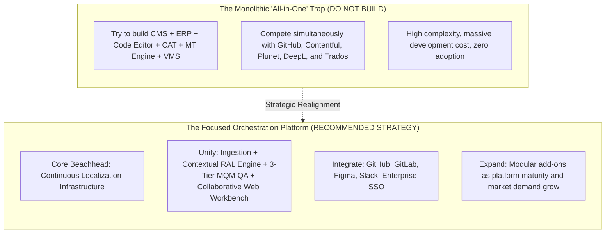

# Product Discovery: The "All-in-One GILT Platform" Critique

This document provides a critical, objective evaluation of the user's initial proposal: **An All-in-One GILT (Globalization, Internationalization, Localization, and Translation) Platform**.

As instructed: **We do not assume this product idea is correct. We treat it as a hypothesis to be rigorously validated or challenged.**

---

## 1. Executive Verdict on the "All-in-One" Hypothesis

> **Strategic Conclusion:** Attempting to build an All-in-One GILT Platform that unifies all 18 proposed areas into a single monolithic product from Day 1 is an **anti-pattern that is almost guaranteed to fail**.
>
> However, an **orchestrated platform that unifies the developer-to-linguist continuous delivery loop** while integrating cleanly with existing adjacent systems (Git, Figma, Slack, CMS, LSPs) represents an **exceptional, high-value market opportunity**.

---

## 2. Why the Monolithic "All-in-One" Approach Fails

Attempting to build an all-in-one product that replaces everything across Globalization, Internationalization, Localization, and Translation encounters five fatal traps:

### Trap 1: The "Jack of All Trades, Master of None" Dilemma

- If a startup attempts to build:
  - A full Content Management System (CMS) $\rightarrow$ it will be worse than Contentful, Sanity, or WordPress.
  - A full Vendor Management & ERP System $\rightarrow$ it will be worse than Plunet or XTRF.
  - A full code development environment $\rightarrow$ developers will never abandon VS Code and GitHub.
- Enterprise buyers refuse to purchase an all-in-one platform where 8 of the 10 bundled tools are mediocre compared to dedicated point solutions.

### Trap 2: Customer Inertia & Integration Realities

- **Developers live in GitHub/GitLab:** They will not log into a foreign UI to manage code branches. Any tool that attempts to replace Git workflows is instantly rejected by engineering teams.
- **Content Marketers live in CMSs:** Marketers will not write blog copy inside a translation tool.
- **Product Designers live in Figma:** Designers will not create wireframes in a TMS.
- **Lesson:** Customers do not want a tool that _replaces_ their core workspace; they want a tool that _integrates invisibly_ into their existing workflow.

### Trap 3: The Vendor Management & ERP Swamp

- Building vendor procurement (purchase order generation, VAT compliance, currency factoring, vendor performance disputes) requires enormous legal, accounting, and compliance overhead. It is a completely different business domain from continuous software localization.

---

## 3. What Should Be Unified vs. What Should Remain Separate

To succeed, Project Alpha must draw strict boundaries between what is unified internally and what is delegated to external integrations:

```mermaid
flowchart LR
    subgraph CoreUnified ["UNIFY INTERNALLY (The Core Platform Engine)"]
        direction TB
        U1["AST String Extraction & Parser Engine"]
        U2["Translation Memory & Termbase Engine"]
        U3["Retrieval-Augmented Localization (RAL) AI Engine"]
        U4["Automated 3-Tier Quality Gate (Deterministic + MQM)"]
        U5["Collaborative Web CAT Workbench & In-Context Preview"]
        U6["Virtual Git Branch Rebase Engine"]
    end

    subgraph Integrated ["INTEGRATE EXTERNALLY (Do Not Replace)"]
        direction TB
        I1["Source Control: GitHub, GitLab, Bitbucket"]
        I2["Design: Figma Plugin API"]
        I3["Communication: Slack & Microsoft Teams Webhooks"]
        I4["Task Tracking: Jira & Linear API"]
        I5["Enterprise Auth: Okta, Google Workspace SAML"]
        I6["AI Foundation Models: OpenAI, Anthropic, Google Vertex"]
    end

    subgraph LeaveSeparate ["LEAVE SEPARATE (Explicitly Out of Scope)"]
        direction TB
        X1["Content Management Systems (CMS)"]
        X2["Vendor ERP, Tax Invoicing & Purchase Orders"]
        X3["Proprietary NMT Model Training from Scratch"]
        X4["Audio Dubbing & Video Subtitling Studios"]
    end

    CoreUnified <--> Integrated
```

| Domain Area                          | Strategy                 | Rationale                                                                                                            |
| :----------------------------------- | :----------------------- | :------------------------------------------------------------------------------------------------------------------- |
| **Translation Memory & Glossaries**  | **UNIFY INTERNALLY**     | Core database required for sub-millisecond RAL prompt grounding and billing leverage calculations.                   |
| **Quality Governance (MQM)**         | **UNIFY INTERNALLY**     | The core differentiator of the platform. Automated triage requires tight integration with parsing and AI generation. |
| **Web CAT Workbench**                | **UNIFY INTERNALLY**     | Translators need a lightning-fast, keyboard-accessible editor with live visual preview and segment locking.          |
| **Git Repositories (GitHub/GitLab)** | **INTEGRATE VIA API**    | Never try to replace Git. Treat Git as the authoritative source of truth.                                            |
| **Design (Figma)**                   | **INTEGRATE VIA API**    | Integrate via bidirectional plugin rather than building design tools.                                                |
| **Vendor ERP (Plunet/XTRF)**         | **LEAVE SEPARATE**       | Massive distraction with high legal/accounting complexity.                                                           |
| **CMS (Contentful/WordPress)**       | **INTEGRATE IN PHASE 2** | Focus on software developer code first; integrate with headless CMSs via webhooks later.                             |

---

## 4. What Would Customers Realistically Switch For?

Customers will **never** switch platforms for a generic "all-in-one" claim. In software sales, "all-in-one" implies bloated, complicated, and expensive.

Customers **will switch** for a solution that solves their single most painful, expensive bottleneck with 10x superiority:

1. **"Zero Merge Conflicts on Git Feature Branches"** (Saves 5–10 engineering hours per sprint).
2. **"Localization Turnaround Dropped from 10 Days to 10 Minutes via Automated MQM Triage"** (Unblocks continuous software releases).
3. **"No Key Caps or Seat Taxes"** (Predictable, fair cloud infrastructure pricing).
4. **"Context-Aware AI that Doesn't Break UI Layouts or Placeholders"** (Eliminates production bugs and embarrassment).
