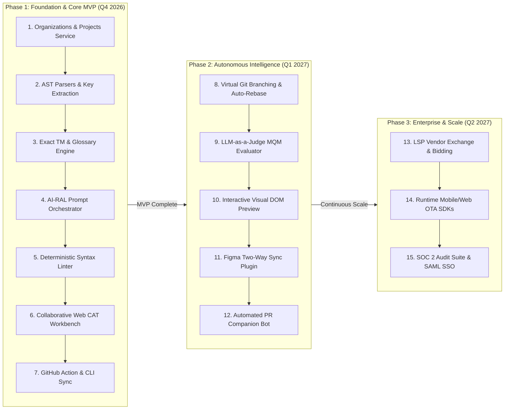

# Product Roadmap: Phased Strategic Evolution

> [!NOTE]
> **Plain-English Summary (In 30 Seconds):**
>
> - **Phase 1 (MVP — The Core Loop):** Connect GitHub to AI so when a developer pushes code, hardcoded strings are automatically extracted, translated, linted, and merged via Pull Request.
> - **Phase 2 (Automated Intelligence):** Add interactive visual previews, Figma sync, and automated quality scoring so teams can approve translations in seconds without waiting for human reviewers.
> - **Phase 3 (Enterprise Scale):** Add translation agency marketplaces, enterprise security (SSO / SOC 2), and over-the-air mobile app updates.

---

## 1. Roadmap Architecture & Phases

---

## 2. Granular Milestone Deliverables

### Phase 1: Foundation & Core MVP (The Continuous Loop)

- **Objective:** Enable software engineering teams to automatically extract, pre-translate, validate, and synchronize strings between Git and native linguists.
- **Key Deliverables:**
  - Multi-tenant Organizations & Projects service with RBAC (`Admin`, `PM`, `Developer`, `Linguist`).
  - AST parsers for JSON, nested JSON, YAML, PO, iOS strings, and Android XML.
  - Exact and fuzzy Translation Memory engine with TMX/TBX import/export.
  - AI-RAL pre-translation prompt engine with glossary injection.
  - Deterministic ICU plural and placeholder validation linters.
  - Responsive, keyboard-accessible Web CAT Workbench with segment locking.
  - Project Alpha CLI (`alpha push / pull`) and GitHub Action integration.

### Phase 2: Autonomous Intelligence & Continuous Workflow

- **Objective:** Eliminate the human review bottleneck and enable zero-conflict Git branch isolation.
- **Key Deliverables:**
  - Virtual copy-on-write Git branch modeling with automatic reconciliation on PR merge.
  - Automated Tier-2 MQM Quality Estimation using LLM-as-a-Judge.
  - Interactive visual DOM preview integrated with Playwright/Cypress end-to-end tests.
  - Figma two-way copy synchronization plugin for product designers.
  - Autonomous PR review companion bot with interactive diff previews.

### Phase 3: Enterprise Ecosystem & Scale

- **Objective:** Expand into enterprise compliance, vendor exchanges, and over-the-air runtime distribution.
- **Key Deliverables:**
  - Vendor marketplace and external LSP handoff portal.
  - Over-the-air (OTA) client SDKs for dynamic iOS, Android, and React runtime updates.
  - Single Sign-On (SAML 2.0 / Okta) and comprehensive SOC 2 Type II audit logging.
  - Fine-tuned domain adapters for high-security on-premise deployments.
