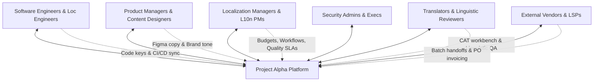

# User Personas: Stakeholder Profiles & Jobs-To-Be-Done Matrix

This document defines the 9 core user personas involved in modern software globalization and localization, their operational responsibilities, acute frustrations, Jobs-to-be-Done (JTBD), and cross-functional interaction touchpoints.

---

## 1. Stakeholder Map

---

## 2. Granular Persona Profiles

### Persona 1: The Localization Manager (Globalization Lead)

- **Profile:** Enterprise Globalization Director or Head of Localization at a mid-market or enterprise tech company.
- **Responsibilities:** Define global localization strategy, manage translation budgets, establish quality benchmarks (MQM thresholds), and report global time-to-market metrics to executive leadership.
- **Goals:** Eliminate localization as the release bottleneck for software deployments; maximize TM and AI leverage to reduce cost-per-word without sacrificing quality; protect global brand reputation.
- **Key Pain Points [PAIN POINT]:**
  - Opaque billing models and surprise overage invoices from legacy TMS vendors.
  - Inability to measure or prove localization quality objectively to executive peers.
  - Managing fragmented toolsets across engineering, marketing, and legal.
- **Jobs-to-be-Done (JTBD):**
  - _Functional:_ "When budgeting for international rollout, I want clear visibility into content volume, TM leverage, and AI efficiency, so that I can forecast costs and allocate vendor spend accurately."
  - _Emotional:_ "I want to feel confident that our global brand reputation is protected from embarrassing mistranslations."
  - _Social:_ "I want to be seen as an enabler of company revenue growth rather than an operational cost center."

---

### Persona 2: The Software Engineer / Full-Stack Developer

- **Profile:** Senior Frontend / Full-Stack Engineer building user-facing web, mobile, or cloud applications.
- **Responsibilities:** Implement internationalization (i18n) logic in code; externalize UI strings into translatable keys; maintain ICU pluralization syntax; maintain CI/CD pipelines and resolve branch merge conflicts.
- **Goals:** Never manually copy-paste translation files or untangle JSON diffs; have CI/CD automatically extract, validate, and translate strings; get immediate feedback in PRs if a string violates ICU formatting.
- **Key Pain Points [PAIN POINT]:**
  - Clunky TMS CLIs that fail silently or require complex proprietary configuration files.
  - Git merge conflicts caused by translators editing JSON files out-of-order in master.
  - Being interrupted by translators asking for string context, screenshots, or clarifying whether a word is a verb or noun.
- **Jobs-to-be-Done (JTBD):**
  - _Functional:_ "When I push a new feature branch to GitHub, I want all newly added or modified i18n keys to be automatically detected, validated, and translated via AI in CI, so that I can merge my code without waiting days for human translators."
  - _Emotional:_ "I want localization to be invisible plumbing that just works, like linting or code formatting."

---

### Persona 3: The Localization Project Manager (Loc PM)

- **Profile:** Operational coordinator managing day-to-day localization tasks.
- **Responsibilities:** Triage incoming string changes, create translation jobs, assign tasks to linguists or LSPs, track project deadlines, and escalate stalled reviews.
- **Goals:** Complete projects on schedule within assigned budget limits; minimize manual repetitive tasks (file conversions, status chasing, re-assignments).
- **Key Pain Points [PAIN POINT]:**
  - Spending 50% of the working day manually downloading, uploading, and checking file formats.
  - Chasing internal country managers or freelance linguists over Slack and email for overdue reviews.
  - Translators rejecting assignments due to complete lack of string context.
- **Jobs-to-be-Done (JTBD):**
  - _Functional:_ "When a new software sprint begins, I want incoming strings automatically routed to appropriate AI or human queues based on project rules, so that I don't spend hours triaging tasks manually."

---

### Persona 4: The Professional Translator / Linguist

- **Profile:** Specialized freelance linguist or agency translator translating into their native tongue.
- **Responsibilities:** Translate source strings accurately adhering to termbases, style guides, and cultural context; post-edit AI/MT drafts (MTPE); flag source text ambiguities or cultural sensitivities.
- **Goals:** Maximize translation speed and accuracy using responsive keyboard shortcuts, high-quality TM matches, and rich context.
- **Key Pain Points [PAIN POINT]:**
  - **"Context Starvation":** Staring at isolated strings in a table without knowing whether "Book" is a noun, a verb, or a button label.
  - Clunky web editors that are sluggish, lack standard CAT keyboard shortcuts, or crash on large files.
  - Having their compensation slashed by aggressive MTPE fuzzy grids while being expected to fix nonsensical machine translation outputs.
- **Jobs-to-be-Done (JTBD):**
  - _Functional:_ "When translating a complex UI string, I want to see an interactive visual preview or screenshot of the exact screen along with glossary definitions, so that I can translate accurately without guessing."

---

### Persona 5: The In-Country / SME Reviewer

- **Profile:** Regional Marketing Manager, Sales Lead, or Local Subject Matter Expert (e.g., Regional Lead in Tokyo or Frankfurt).
- **Responsibilities:** Review localized applications and marketing assets for local market fit, tone, and cultural resonance; verify domain-specific compliance.
- **Goals:** Ensure the local user experience feels authentic, natural, and persuasive; complete reviews rapidly without getting bogged down in complex linguistic tooling.
- **Key Pain Points [PAIN POINT]:**
  - Refusing to use traditional CAT tools because the interfaces are too complex and unintuitive.
  - Reviewing text in spreadsheet rows without visual context, leading to suggestions that break UI layout constraints.
  - Becoming the single point of failure that delays global software launches.
- **Jobs-to-be-Done (JTBD):**
  - _Functional:_ "When asked to review a localized landing page or app screen, I want to review it in-context with an interactive visual preview, make quick text edits, and click 'Approve' in under 5 minutes."

---

### Persona 6: The Localization Engineer

- **Profile:** Technical specialist bridging software engineering and linguistic tools.
- **Responsibilities:** Build and maintain file parsing configurations, filters, and string extraction scripts; configure CI/CD pipelines, Git integrations, and webhook handlers; troubleshoot broken formatting and invalid ICU expressions.
- **Goals:** Fully automate the exchange of content between code repositories and the TMS; zero encoding corruptions.
- **Key Pain Points [PAIN POINT]:**
  - Fragile regex-based parsers that corrupt nested JSON or multi-line strings.
  - Having to write custom middleware to handle edge-case file formats.
- **Jobs-to-be-Done (JTBD):**
  - _Functional:_ "When introducing a new file format or framework to our stack, I want robust, AST-based parsers and well-documented webhooks/APIs, so that I can set up automated sync in an hour rather than writing custom parsers."

---

### Persona 7: The Product Designer / Content Strategist

- **Profile:** UX Designer or UX Writer using Figma or Sketch.
- **Responsibilities:** Design user interfaces and write clear, concise user-facing microcopy; test UI layouts against international text expansion.
- **Goals:** Push UX copy directly from Figma into the TMS before engineering writes code; test designs with pseudo-localization and real translated copy inside Figma.
- **Key Pain Points [PAIN POINT]:**
  - Designs that look pristine in English breaking horribly when localized because developers didn't account for text expansion.
  - Disconnect between design copy and engineering string keys.
- **Jobs-to-be-Done (JTBD):**
  - _Functional:_ "When finalizing UI mockups in Figma, I want to test the screens against real translated strings and pseudo-localization with one click, so that I can fix layout breaks before handoff to engineering."

---

### Persona 8: The External Vendor / Language Service Provider (LSP) Lead

- **Profile:** Account Director or Project Manager at an external translation agency.
- **Responsibilities:** Receive translation work batches, allocate to agency linguists, deliver within contractual SLAs, and manage billing.
- **Goals:** Seamlessly ingest client work into their internal workflow tools; receive clean, context-rich files with pre-configured TMs and glossaries.
- **Key Pain Points [PAIN POINT]:**
  - Incompatible client portals that require logging into dozens of client environments.
  - Ambiguous fuzzy-match grids and disputed word counts.

---

### Persona 9: The Platform Administrator / Security & Compliance Officer

- **Profile:** IT Director or Enterprise Security Architect.
- **Responsibilities:** Enforce corporate identity, Single Sign-On (SSO / SAML 2.0), and Multi-Factor Authentication (MFA); ensure data privacy compliance (GDPR, SOC 2, HIPAA, ISO 27001).
- **Goals:** Guarantee that no enterprise source content or user PII is retained or used to train public AI foundation models; full immutable audit trails of all system actions.
- **Key Pain Points [PAIN POINT]:**
  - Ungoverned cloud SaaS tools leaking source code strings or customer PII to external AI APIs.
  - Inability to export complete access logs or revoke compromised access tokens instantly.
