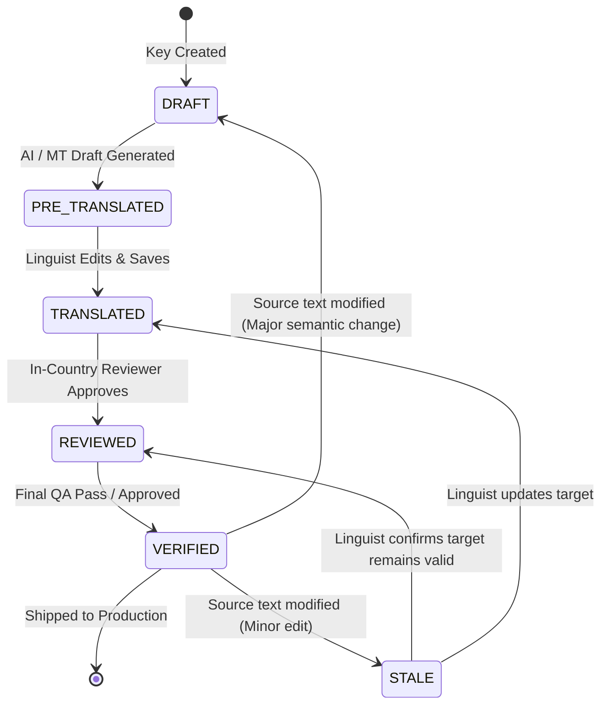

# Workflows: Formal Domain Business Rules

This document details the formal business logic rules and state machines governing Translation Memory (TM) leverage, string invalidation, concurrent editor locking, and placeholder integrity.

---

## 1. Translation Memory Leverage & Discount Grid

The platform classifies translation memory matches into standard industry tiers to determine billing, automation eligibility, and human effort:

| Match Category           | Similarity Score   | TM Criteria                                                          | Automation Action                                  | Standard Leverage Pay Rate |
| :----------------------- | :----------------- | :------------------------------------------------------------------- | :------------------------------------------------- | :------------------------- |
| **ICE Match (102%)**     | $100\%$ + Context  | Identical source text + identical string key + identical parent file | Auto-apply, mark `VERIFIED`, lock against editing  | 0% (Free leverage)         |
| **Context Match (101%)** | $100\%$ + Neighbor | Identical source text + identical preceding & succeeding segments    | Auto-apply, mark `VERIFIED`, lock                  | 0%–10%                     |
| **Exact Match (100%)**   | $100\%$ Text Only  | Identical normalized source text, different key or file              | Auto-apply, mark `TRANSLATED`, flag for spot-check | 20%–30%                    |
| **High Fuzzy**           | $85\%–99\%$        | Levenshtein/token distance $\ge 0.85$                                | Populate as suggestion in workbench & prompt       | 50%–60%                    |
| **Mid Fuzzy**            | $75\%–84\%$        | Levenshtein/token distance $\ge 0.75$                                | Populate as reference suggestion                   | 70%–80%                    |
| **New / No Match**       | $< 75\%$           | No usable similarity found                                           | Route to AI Pre-translation / Full Translation     | 100% (Full rate)           |

---

## 2. String Invalidation State Machine

When a developer or content creator modifies existing source text, the platform enforces strict invalidation rules to prevent stale translations:

- **Rule 2.1 (Character Diff Threshold):**
  - If the modified source text has a Levenshtein similarity $\ge 95\%$ against the previous source (e.g., fixing a minor typo or punctuation mark), existing target translations transition to state `STALE`.
  - If similarity is $< 95\%$, existing translations are archived into revision history and the segment transitions to `DRAFT` (requires re-translation).
- **Rule 2.2 (Context Preservation):** All comments, screenshots, and issue discussions attached to a key persist across source string revisions.
- **Rule 2.3 (Rollback Protection):** Every translation edit creates an immutable, append-only record in the `translation_revisions` table with author ID, timestamp, and previous state, enabling instantaneous rollbacks.

---

## 3. Editor Concurrency & Segment Locking

To prevent race conditions during collaborative editing:

- **Rule 3.1 (Pessimistic Segment Lock):** When a user or background process focuses a segment in the Workbench, a distributed lock is acquired (backed by Redis or PostgreSQL `pg_locks` with a 120-second sliding expiration).
- **Rule 3.2 (Visual Indicator):** Other users attempting to edit the same segment receive a live WebSocket notification showing the avatar of the active editor, and the field enters a read-only state.
- **Rule 3.3 (Lock Heartbeat):** The active editor's browser sends a heartbeat every 30 seconds. If the user disconnects or is idle for $> 120$ seconds, the lock is released automatically.

---

## 4. Placeholder & Token Integrity Enforcement

A translation unit **CANNOT** transition to `VERIFIED` or be exported into a production deployment bundle if it violates token integrity:

- **Rule 4.1 (Verbatim Placeholder Identity):** All named tokens (e.g., `{userName}`, `{totalPrice}`) and indexed tokens (`%1$s`, `%2$d`) present in the source string must exist in the target string. Renaming, translating, or omitting a token throws a fatal validation error.
- **Rule 4.2 (Tag Balance):** Unpaired or mismatched HTML/XML/Markdown tags (e.g., source has `<b>Click here</b>`, target has `<b>Cliquez ici`) will fail build verification and trigger an immediate linter alert.
- **Rule 4.3 (CLDR Plural Completeness):** For ICU plural strings, the target translation must supply all plural categories required by the target locale's Unicode CLDR specification:
  - English requires: `one`, `other`.
  - Arabic requires: `zero`, `one`, `two`, `few`, `many`, `other`.
  - Russian requires: `one`, `few`, `many`.
  - Missing a mandatory locale plural form throws a compile error.
