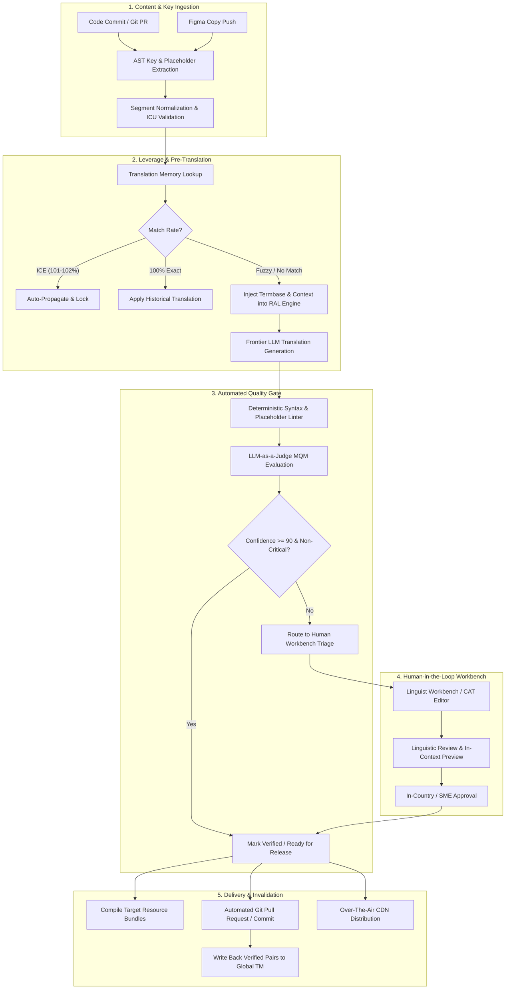

# Workflows: End-to-End Operational Reality Map

This document maps the real-world operational workflows involved in enterprise software localization, documenting inputs, outputs, systems involved, failure points, and manual bottlenecks across every phase.

---

## 1. End-to-End Workflow Flowchart

---

## 2. Granular Stage-by-Stage Operational Map

### Stage 1: Content Creation & Internationalization (i18n)

- **Roles:** Software Engineers, Product Designers, UX Writers.
- **Inputs:** Figma design frames, React/Vue/mobile source code files, copy drafts.
- **Systems Involved:** Figma, VS Code / IDE, GitHub / GitLab.
- **Manual vs. Automated:**
  - _Manual:_ Wrapping hardcoded strings in translation functions (`t('auth.login_btn')`), creating key names, choosing interpolation variables.
  - _Automated:_ AST linters (`eslint-plugin-i18next`) flagging hardcoded strings in code.
- **Failure Points & Bottlenecks [PAIN POINT]:**
  - Engineers concatenate strings programmatically (e.g., `t("Hello") + " " + user.name`), destroying translatability for languages with different sentence order (SOV languages like Japanese).
  - Cryptic key naming (`btn_3_v2`) that deprives linguists of semantic meaning.

### Stage 2: Content Extraction & Ingestion

- **Roles:** Software Engineer, CI/CD Pipeline, Localization Engineer.
- **Inputs:** Source JSON, YAML, PO, iOS strings, Android XML files.
- **Systems Involved:** Git CI/CD, Project Alpha CLI, REST API.
- **Manual vs. Automated:** Fully automated via webhook triggers on pull requests or branch pushes.
- **Failure Points & Bottlenecks [PAIN POINT]:**
  - Malformed JSON (trailing commas), unescaped quotes, or broken ICU plural brackets causing parser crashes.

### Stage 3: Pre-Translation & Leverage Matching

- **Roles:** Platform Engine (Autonomous).
- **Inputs:** Extracted source segments, historical Translation Memory (TM) database, Termbases.
- **Systems Involved:** PostgreSQL pgvector, Redis exact hash cache, RAL Prompt Orchestrator, LLM provider.
- **Manual vs. Automated:** 100% automated.
- **Failure Points & Bottlenecks [PAIN POINT]:**
  - Outdated TM entries overwriting newer branded terminology.
  - In-Context Exact (ICE) false positives if surrounding context has changed meaning.

### Stage 4: Quality Gate & Triage

- **Roles:** Platform Quality Engine, Localization PM.
- **Inputs:** Candidate translations, source text, glossaries, ICU rules.
- **Systems Involved:** Tier-1 Syntax Linter, Tier-2 LLM-as-a-Judge MQM Scorer.
- **Manual vs. Automated:**
  - Automated: Linter and MQM scoring.
  - Manual: Loc PM reviewing borderline cases (scores 85–89) or high-risk legal/financial segments.
- **Failure Points & Bottlenecks [PAIN POINT]:**
  - High latency if LLM evaluation queues back up during massive 10,000-key batch imports.

### Stage 5: Translation & Linguistic Review (CAT Workbench)

- **Roles:** Professional Translators, Freelance Linguists.
- **Inputs:** Assigned translation jobs, UI screenshots, glossary cards, TM fuzzy suggestions.
- **Systems Involved:** Web CAT Workbench, WebSocket Gateway.
- **Manual vs. Automated:** Manual human editing assisted by interactive CAT features.
- **Failure Points & Bottlenecks [PAIN POINT]:**
  - **"Context Starvation":** Translators pausing work to ask for visual screenshots.
  - Sluggish web editors that lag when typing or navigating large documents.

### Stage 6: In-Country / SME Approval

- **Roles:** Regional Marketing Directors, In-Country Country Managers.
- **Inputs:** Translated UI screens or staging app environments.
- **Systems Involved:** Web Previewer, Figma, Slack notification bot.
- **Manual vs. Automated:** 100% manual review.
- **Failure Points & Bottlenecks [PAIN POINT]:**
  - **The #1 Release Bottleneck:** Regional managers ignoring review requests for weeks, stalling software deployment.

### Stage 7: Delivery, Merge & TM Write-Back

- **Roles:** CI/CD Bot, Software Engineers.
- **Inputs:** Verified translation units.
- **Systems Involved:** GitHub/GitLab API, Octokit, production build pipelines.
- **Manual vs. Automated:** Automated PR creation and commit pushes.
- **Failure Points & Bottlenecks [PAIN POINT]:**
  - Git merge conflicts when feature branches have diverged from `main`.
