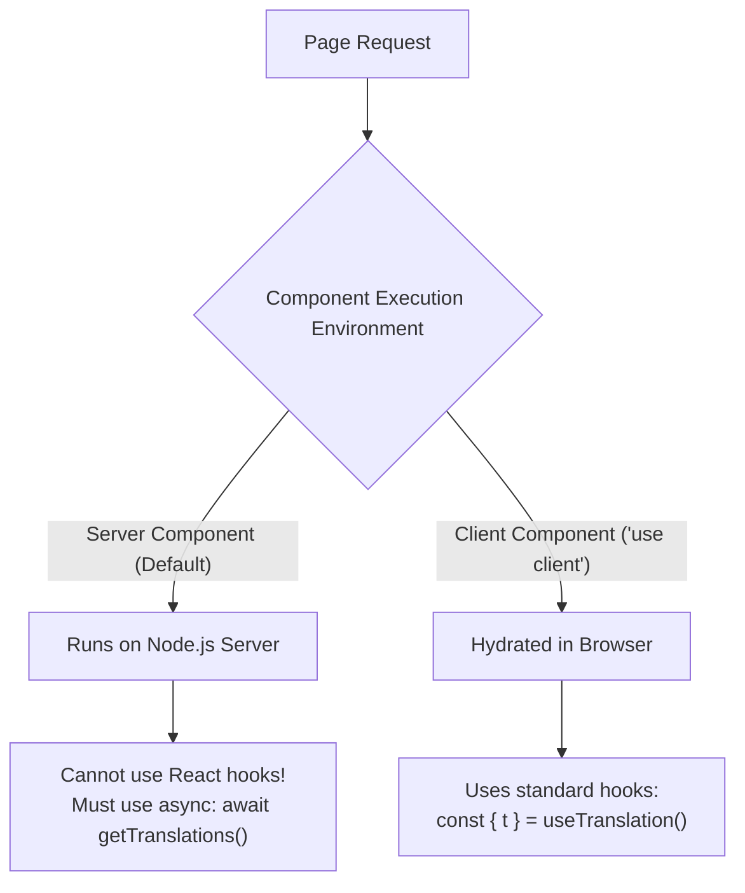
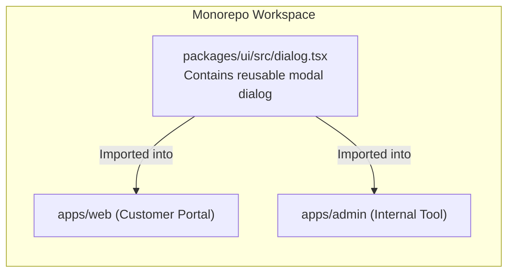

# Workflows: Modern Frontend Framework Realities

> [!NOTE]
> **Plain-English Summary (In 30 Seconds):**
>
> - **React Server Components (RSC):** In modern frameworks like Next.js 14/15, pages are split into code that runs only on the server and code that runs in the browser. You cannot use standard React hooks (`useTranslation`) on the server! An automated tool must know which file type it is editing.
> - **Monorepos:** When multiple apps share a single button component in a shared UI package, where do translations live? A centralized dictionary vs. component-level scoping.
> - **The "Lego Brick" Anti-Pattern:** Programmers often write code like `t("status_" + status)`. Automated linters cannot guess what `status` is at build time, leading to missing translations.

---

## 1. Next.js App Router: Server vs. Client Components

In modern full-stack frameworks (Next.js 14/15, Remix, Astro), components fall into two strictly separated execution environments:



### The Code Transformation Rules

#### In a Server Component (`app/[locale]/page.tsx`):

```tsx
// ❌ WRONG: Fails with runtime crash (Hooks cannot run in Server Components)
import { useTranslation } from "react-i18next";
export default function Dashboard() {
  const { t } = useTranslation();
  return <h1>{t("dashboard.title")}</h1>;
}

// ✅ CORRECT: Async Server Translation Loader
import { getTranslations } from "next-intl/server";
export default async function Dashboard() {
  const t = await getTranslations("dashboard");
  return <h1>{t("title")}</h1>;
}
```

#### In a Client Component (`components/checkout-modal.tsx`):

```tsx
"use client";
import { useTranslations } from "next-intl";

export function CheckoutModal() {
  const t = useTranslations("checkout");
  return <button>{t("pay_now")}</button>;
}
```

**Project Alpha Parser Requirement:** Our AST scanner must check for the presence of the `'use client'` directive before injecting i18n imports to prevent breaking Server Component rendering.

---

## 2. Monorepos & Shared UI Libraries

In modern Turborepo and pnpm monorepos (such as `project_alpha`), code is divided into apps (`apps/web`, `apps/admin`) and shared packages (`packages/ui`):



### Where Do Translations Live?

There are two architectural approaches to shared components:

1. **Pass-Through Props Pattern (Recommended for Pure UI Libraries):**
   - The shared component in `packages/ui` takes localized strings as standard React props:
     ```tsx
     // packages/ui/src/dialog.tsx
     export function ConfirmDialog({ title, confirmText }: { title: string; confirmText: string }) {
       return (
         <div>
           <h3>{title}</h3>
           <button>{confirmText}</button>
         </div>
       );
     }
     ```
   - The consuming application passes the translated text from its own namespace. This keeps `packages/ui` completely agnostic of i18n runtimes.
2. **Package-Scoped Namespaces:**
   - If a shared package contains complex internal text, it exports its own translation dictionary (`packages/ui/locales/en.json`), which is deep-merged into the root translation bundle at build time.

---

## 3. The "Lego Brick" Anti-Pattern (Dynamic String Keys)

A frequent real-world bug in software localization is developers constructing translation keys dynamically:

```tsx
// ❌ BAD: The Lego Brick Anti-Pattern
const status = "pending"; // or "completed", "failed"
return <span>{t("order_status_" + status)}</span>;
```

### Why This Breaks the Toolchain

- A static AST analyzer scanning code cannot evaluate runtime JavaScript variables. It cannot know what values `status` will hold.
- As a result, `order_status_pending` and `order_status_failed` are **never extracted**, resulting in blank strings in production!

### The Type-Safe Solution

To guarantee extraction and prevent runtime missing-key bugs, developers must use an explicit dictionary map or TypeScript enum:

```tsx
// ✅ GOOD: Explicit Dictionary Mapping
const STATUS_KEYS = {
  pending: t("order.status.pending"),
  completed: t("order.status.completed"),
  failed: t("order.status.failed"),
} as const;

return <span>{STATUS_KEYS[status]}</span>;
```

**Project Alpha Linter Rule:** Our ESLint plugin flags string concatenation inside `t()` functions as an unextractable dynamic key warning.
