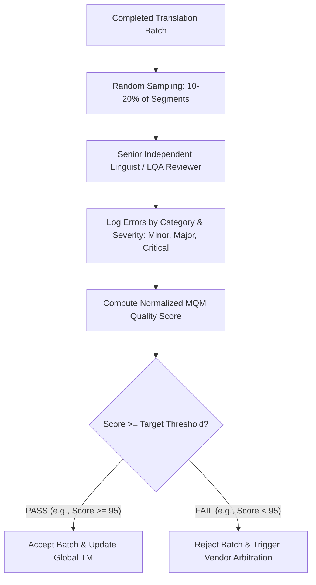

# Workflows: Linguistic Quality Assurance (LQA) & Vendor Mechanics

> [!NOTE]
> **Plain-English Summary (In 30 Seconds):**
>
> - **LQA (Linguistic Quality Assurance):** The formal grading process where a second, independent linguist samples 10%–20% of translated content to audit for accuracy, grammar, and brand consistency using a mathematical penalty score.
> - **Vendor Economics:** Freelance translators and translation agencies rarely bill by the hour. They bill by the word (e.g., \$0.10–\$0.25/word), but enforce minimum job fees (e.g., \$15 to \$30 just to open a file).
> - **Why Automated Triage Saves Fortunes:** By using AI to auto-verify routine strings, companies avoid triggering minimum vendor fees for small 3-word UI copy changes.

---

## 1. Linguistic Quality Assurance (LQA) Workflow

LQA is the objective quality auditing framework standardized by **ISO 17100** and the **W3C Multidimensional Quality Metrics (MQM)** standard:

### Industry MQM Quality Thresholds by Content Type

| Content Category                | Target MQM Score | Error Tolerance                              | Quality Level Rationale                                                        |
| :------------------------------ | :--------------: | :------------------------------------------- | :----------------------------------------------------------------------------- |
| **Legal, Financial & Medical**  |    $\ge 98.0$    | Zero Critical, max 1 Minor                   | High liability; mistranslations risk legal lawsuits or regulatory fines.       |
| **Core Product Software UI**    |    $\ge 95.0$    | Zero Critical, max 2 Minor                   | First impression; broken placeholders or truncated buttons degrade user trust. |
| **Marketing Landing Pages**     |    $\ge 90.0$    | Zero Critical, stylistic adjustments allowed | Focus on persuasive tone, emotional resonance, and conversion rate.            |
| **Internal Help Center / FAQs** |    $\ge 80.0$    | Minor grammatical roughness tolerated        | Utilitarian purpose; speed and comprehension outweigh stylistic perfection.    |

---

## 2. Real-World Vendor Commercial Mechanics

Understanding how external Language Service Providers (LSPs) and freelance translators price their services is crucial for designing a cost-effective platform:

### 1. The Per-Word Fuzzy Match Grid

LSPs calculate project costs based on the Translation Memory (TM) leverage grid:

- **New Words (0%–74% Match):** Billed at 100% of standard rate (e.g., \$0.16/word).
- **Fuzzy Matches (75%–99% Match):** Billed at 50%–70% of standard rate.
- **100% Exact Matches:** Billed at 20%–30% of standard rate (nominal fee for spot-checking).
- **In-Context Exact (ICE / 102%):** Billed at 0% (free reuse).

### 2. The Minimum Fee Trap

- **The Reality [PAIN POINT]:** Translators enforce a **minimum fee per job** (\$15 to \$35).
- **The Developer Friction:** If an agile engineer changes a single button label from "Submit" to "Continue" (1 word), sending that 1-word job to an external vendor costs \$25 because of the minimum fee!
- **Project Alpha's Solution:** By routing short UI copy through our **Retrieval-Augmented Localization (RAL) + Tier-1 Syntax Linter**, the change is translated and verified in 2 seconds at a cost of \$0.0001, completely eliminating vendor minimum fees.

### 3. MTPE (Machine Translation Post-Editing) Pay Rates

- When human linguists are hired not to translate from scratch, but to review and edit AI drafts:
  - **Light Post-Editing:** Billed at an hourly rate (\$35–\$60/hr) with target output expectations of 800–1,200 words per hour.
  - **Full Post-Editing (ISO 18587):** Billed at 55%–65% of the standard per-word rate, producing human-equivalent quality.
